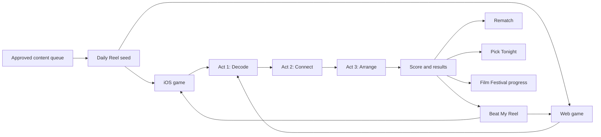

# Daily Puzzle Three-Round Run

## Problem Frame

Daily Puzzle currently supports continuous next-puzzle play, but it does not give players a short, visible goal or a satisfying session payoff. A three-round run should make the loop easier to understand, increase multi-puzzle continuation, and create a natural monetization boundary without increasing ad frequency.

## Requirements

**Progress and completion**
- R1. Every active puzzle displays its round as `1 of 3`, `2 of 3`, or `3 of 3` with visible progress and an equivalent accessibility value.
- R2. A round completes whether the player solves the puzzle or exhausts all attempts.
- R3. Rounds one and two retain the existing `Next Puzzle` action.
- R4. Completing round three displays a Daily Run summary before the player decides whether to continue.

**Summary and continuation**
- R5. The summary displays solved rounds, total attempts, total unlocked hints, and the current daily streak.
- R6. The summary provides a `Share Run` action with the run score and cumulative stats.
- R7. The round-three continuation action is labeled `Keep Playing` and starts a fresh three-round run.
- R8. Continuing after round three preserves the existing user-initiated interstitial opportunity and all existing cooldown/session caps; no ad appears automatically on completion.
- R9. Partial run state is session-only in version one and does not need to survive app termination.

**Measurement**
- R10. Analytics capture run start, run completion, run sharing, and post-completion continuation with build, session, solved-round, attempts, hint, and completion context.
- R11. Existing per-puzzle events and identifiers remain unchanged so historical funnels stay comparable.

## Success Criteria

- Players can always tell which round they are playing and how close they are to completing the run.
- The third terminal puzzle produces exactly one summary with accurate cumulative totals.
- The summary can share a readable three-round score without exposing an answer.
- `Keep Playing` loads a new first round after the existing ad decision completes or is skipped.
- PostHog can measure run-start-to-run-completion and run-completion-to-continue conversion by build.
- Existing Daily Puzzle and ad cadence tests remain green.

## Scope Boundaries

- No new ad placements or increased frequency.
- No persisted or cross-device partial-run state in version one.
- No leaderboard, multiplayer challenge, prize, currency, or subscription changes.
- No backend or puzzle-content schema changes.

## Key Decisions

- Three terminal rounds define one run: this gives a short goal and aligns with the existing third-round interstitial opportunity.
- Failed puzzles count toward completion: users should not be trapped in a run because a clue was difficult.
- Summary precedes monetization: the user receives the accomplishment payoff before choosing to continue.

## Dependencies / Assumptions

- The existing solve-to-next flow and per-trigger interstitial cadence remain the continuation mechanism.
- Existing common telemetry continues attaching app version, build number, and runtime session ID.

## Next Steps

-> `/ce:plan` for structured implementation planning.

---

## Daily Reel Expansion (2026-08-28)

This section extends the existing three-round Daily Puzzle into Daily Reel. It supersedes any earlier boundary that excludes social challenges, mixed puzzle formats, weekly rewards, or a playable web experience. The existing three-round progression, completion summary, sharing foundation, and telemetry remain the base behavior unless explicitly changed below.

### Problem Frame

The current emoji-only loop is too narrow to sustain long-term mastery, social competition, and repeat visits. Daily Reel should become a cohesive movie-game ritual: three fast acts under one daily theme, a score players understand, a weekly reason to return, and a challenge that friends can play immediately on iOS or the web. The product must increase engagement and revenue through more valuable play rather than more disruptive ad pressure, while producing comparable PostHog evidence about which mechanics work.

### Experience Flow

### Requirements

**Daily Reel Core**

- DR1. Daily Reel must extend the existing three-round run rather than create a disconnected game mode.
- DR2. Every Reel must contain three fixed act roles under one curated daily movie theme:
  - Act 1, Decode: solve an emoji movie clue.
  - Act 2, Connect: view three films and choose their shared link from four answers. Supported links are actor, director, franchise, genre, or theme.
  - Act 3, Arrange: order three films from earliest to latest theatrical release date.
- DR3. Each act must use a different answer while remaining clearly connected to the Reel's theme.
- DR4. Connect and Arrange content must be factually unambiguous. Candidate generation must avoid disputed connections, misleading distractors, and release-date ties that make the expected order unclear.
- DR5. iOS and web must use the same daily content version, rules, answers, and scoring. A given challenge must remain identical across both platforms.
- DR6. The run must be completion-first. Mistakes and score-affecting clues reduce points, but a failed or revealed act still advances to the next act. No act may permanently block completion.
- DR7. Daily Reel must not use a timer for scoring or progression.
- DR8. Each act is worth up to 100 points, for a maximum Reel Score of 300:
  - 100 points for a correct first attempt without a score-affecting clue.
  - 75 points after exactly one score-affecting assistance event, defined as one mistake or one requested clue.
  - 50 points after two or more assistance events when the player still solves the act.
  - 0 points when the player uses Reveal or exhausts the act's allowed attempts.
  - Existing information explicitly presented as a free clue, including the title-length pattern, does not reduce the score.
- DR9. The results screen must show each act's score, the 0-300 total, completion state, assistance used, weekly progress, and spoiler-free social actions.
- DR10. The Reel must support localized puzzle titles, accepted answer aliases, clues, answer choices, explanations, sharing text, and result text in English, French, Spanish, Mexican Spanish, and Brazilian Portuguese.
- DR10A. The first encounter with each act type must provide a concise, skippable instruction and a non-scoring example. Later plays must not repeatedly interrupt experienced players with the same instruction.
- DR10B. Arrange must support touch dragging plus a non-drag alternative usable with taps, keyboard controls, and screen-reader actions. Every act must support Dynamic Type, sufficient contrast, reduced motion, and meaningful accessibility labels.
- DR10C. Loading, empty, offline, invalid-link, expired-challenge, and content-error states must preserve a clear next action. Eligible cached or evergreen content may be offered when safe; otherwise the player must be able to retry or return to today's Reel without losing completed progress.

**Weekly Retention Loop**

- DR11. Film Festival progress must advance when a player completes any five distinct Daily Reels within the existing user-local weekly boundary.
- DR12. Completing a Film Festival must grant a permanent themed collectible badge and one Encore play drawn from an archived Reel in that Festival's theme.
- DR13. Festival progress, earned badges, and unused Encore plays must persist locally without requiring an account on iOS or web.
- DR13A. The product must describe this progress as device- or browser-local and must not imply cross-device recovery. Clearing site data, deleting the app, or changing devices may remove unsynchronized progress.
- DR14. A pre-approved evergreen fallback pack must prevent a missed Daily Reel when scheduled content is unavailable.

**Beat My Reel Social Loop**

- DR15. A completed Reel must offer Beat My Reel, a spoiler-free challenge link containing an opaque challenge identifier and a frozen content and ruleset reference.
- DR16. A Beat My Reel challenge expires 48 hours after it is sent. The recipient must play the identical Reel payload and scoring rules even if the public Daily Reel changes.
- DR17. The sender's score must remain hidden until the recipient finishes. Results may then compare both totals and act-level outcomes without exposing answers before completion.
- DR18. Challenge participation must require no account or sign-in. Identity is an anonymous installation or browser identity with an optional display name.
- DR19. Challenge surfaces may expose only the optional display name and completed challenge score. They must not expose a public profile, play history, email address, advertising identifier, or other personal details.
- DR19A. Challenge results must validate the frozen content version, ruleset, completion state, and score integrity rather than trusting an arbitrary client-submitted score.
- DR20. The challenger must receive the result in the app or web game when the recipient finishes. Push notifications are not required for the first release.
- DR21. The comparison screen must present Rematch before watchlist, streaming-provider, or install actions.
- DR22. Below the primary Rematch action, results must present one Pick Tonight movie from the Reel theme with the watchlist and streaming-provider actions available on that platform. Cross-device watchlist synchronization is not required.

**Playable Web Product**

- DR23. The web experience must be a full puzzle product, not a landing-page teaser. It must support today's Daily Reel, Festival progress, earned badges, Encore, challenge creation and acceptance, rematches, sharing, Pick Tonight, anonymous local progress, and complete analytics.
- DR24. Web players must be able to complete a Daily Reel or challenge without an install wall. An App Store call to action may appear after results but must not block play, results, rematches, or continued web participation.
- DR25. Web and iOS presentation may adapt to their platforms, but neither platform may change the content, correct answers, assistance effects, challenge fairness, or score interpretation.

**Editorial Approval and Reliability**

- DR26. Daily Reel content production must use curated automation: generate candidate themes and acts, validate facts and localizations, and surface automated duplication, difficulty, safety, and completeness checks before publication.
- DR27. Editorial control must be an approval queue, not a general-purpose content-management system. Each candidate card must show the theme, all three acts, correct answers, clues, localization status, and automated validation results.
- DR28. The primary editorial actions are Approve and Deny. Approve schedules the candidate. Deny discards it and immediately generates a replacement without requiring a reason. Detailed editing remains optional behind Review Details.
- DR29. Normal candidates require explicit approval. If the approved queue is empty, the system may automatically publish only a fully validated fallback Reel; it must prefer the pre-approved evergreen fallback pack when an eligible Reel exists.
- DR30. The system must target a rolling queue of at least 14 approved Daily Reels and send at most one daily reminder only when fewer than seven approved Reels remain.
- DR31. Approval must show English first with one-tap previews for French, Spanish, Mexican Spanish, and Brazilian Portuguese rather than presenting every locale simultaneously.

**Monetization and Policy**

- DR32. All three acts must remain free of interrupting ads on iOS and web. Monetization is limited to explicitly requested rewarded help and placements after completion.
- DR33. An unavailable or declined rewarded ad must never prevent a clue, completion, results, Festival progress, challenge play, or rematch.
- DR34. Revenue optimization must prioritize more Reel starters, completions, returns, challenges, and useful movie actions before any increase in ad frequency.

**PostHog Experiments and Measurement**

- DR35. PostHog feature flags must control experimental game mechanics and record flag exposure on both iOS and web. A separate kill-switch system is not required.
- DR36. Multiple experiments may run concurrently, but PostHog cohorts must assign each user one coherent game configuration and prevent conflicting mechanics from overlapping.
- DR37. Challenge fairness overrides ordinary cohort assignment. A challenge must freeze the sender's relevant gameplay configuration so the recipient receives the same rules; both exposures must still be recorded accurately.
- DR38. Analytics must cover absolute users and sessions as well as rates for:
  - Reel started and fully completed.
  - Each act viewed, attempted, assisted, revealed, failed, and completed.
  - Score and assistance distribution by act and total Reel Score.
  - Challenge created, shared, opened, accepted, completed, compared, and rematched.
  - Challenge-attributed web visit and app install when attribution is available.
  - Film Festival progress and completion, badge earned, Encore earned, and Encore played.
  - Pick Tonight viewed, watchlisted, and streaming-provider action selected.
  - Rewarded-ad offered, accepted, shown, completed, unavailable, and reward granted.
  - Ad requests, impressions, show rate, eCPM, CTR, and revenue.
  - Day 1 and Day 7 return, crash-free usage, content denials, and localization failures.
- DR39. Every relevant event must include non-personal context needed for comparison: platform, app or web version, locale, region, Reel identifier and content version, theme, act, challenge state, anonymous identity, PostHog flag and cohort assignment, and ad context when applicable.
- DR39A. Analytics must not capture optional display names, raw challenge tokens, puzzle answers, free-form user input, email addresses, or advertising identifiers. Retention and deletion behavior must match the published privacy disclosures for both platforms.
- DR40. Experiment decisions must wait for at least 100 unique Reel starters per cohort and a complete Day 7 observation window unless a crash, privacy, policy, or content-safety issue requires immediate intervention.
- DR41. At the minimum sample, a mechanic qualifies for a provisional keep or measured expansion when full completion, Day 7 return, or revenue per Reel starter improves by at least 10 percent relative to its comparison cohort without another primary metric or crash-free usage worsening by more than 5 percent. The decision report must include absolute counts and uncertainty; the threshold is directional evidence, not statistical proof. Results below the minimum sample remain inconclusive rather than wins or losses.
- DR42. The approved first-release program must be enabled through measurable checkpoints rather than a single global launch. Each checkpoint requires confirmed content availability, platform-consistent behavior, PostHog exposure and outcome events, privacy and ad-policy safeguards, and crash-free guardrails before broader exposure. Staging changes sequence, not approved scope.

### Success Criteria

- Players can complete the same fair, localized three-act Reel on iOS and web and understand why they received a 0-300 score.
- Full-Reel completion and Day 7 return can be measured by platform, locale, region, challenge state, and PostHog cohort using absolute counts beside rates.
- Beat My Reel can be created, opened, completed, compared, and rematched across iOS and web without sign-in or answer leakage.
- The content operation maintains 14 approved days under normal conditions, alerts only below seven, and serves a valid fallback rather than missing a day.
- Film Festival, badges, and Encore create a measurable five-day weekly return loop on both platforms.
- Pick Tonight creates a measurable bridge from game engagement into watchlist and streaming-provider intent.
- Revenue per Reel starter and rewarded-ad opt-in can improve without interrupting any act or regressing completion, Day 7 return, crash-free usage, privacy, or ad-policy compliance.
- Each experiment reaches the minimum sample rule before receiving a keep, change, expand, or revert decision.
- Each launch checkpoint produces an explicit go, hold, change, or revert decision before broader exposure.

### Scope Boundaries

**Build in the first release**

- Three-act Daily Reel with curated themes and 0-300 scoring.
- Film Festival, collectible badges, and Encore.
- Beat My Reel, result comparison, and rematches.
- Full playable web puzzle product with anonymous local progress.
- Pick Tonight and available platform-specific movie actions.
- Curated content generation and the approval queue.
- Five-locale puzzle content and sharing support.
- PostHog feature flags, isolated concurrent cohorts, and the defined analytics.
- Optional rewarded help and post-completion ad placements only.

**Explicitly deferred**

- Required accounts, account profiles, and cross-device progress or watchlist synchronization.
- Game Center integration.
- Live or group multiplayer and pair streaks.
- User-created or publicly submitted puzzles.
- Public leaderboards, profiles, or play histories.
- Premium puzzle packs or subscriptions.
- A full movie-tracking and watchlist product on the web.
- Licensed audio, film clips, or quotation-based acts.
- A separate experiment kill-switch layer beyond PostHog feature-flag controls.

### Key Decisions

- Extend the existing run: preserves the current player habit and instrumentation instead of splitting traffic across modes.
- Fixed act roles with controlled variation: teaches a recognizable ritual while giving each day more texture than emoji-only play.
- Curated daily themes: makes three different answers feel like one cohesive experience.
- Completion-first scoring: supports mastery and sharing without turning difficult content into a dead end.
- Full web puzzle parity: maximizes challenge conversion and creates a meaningful acquisition surface rather than an App Store interstitial.
- Anonymous participation: removes account friction while intentionally limiting social data exposure.
- Human approval with automated candidates: combines editorial quality with enough throughput to sustain daily localized content.
- PostHog cohorts for concurrent experiments: allows multiple ideas to run while protecting coherent player experiences and attributable comparisons.
- Staged activation: preserves the full product ambition while isolating regressions and producing evidence at each expansion checkpoint.
- No ads between acts: protects retention and ad-policy safety; revenue growth comes from useful engagement and optional monetization.

### Dependencies and Assumptions

- The existing three-round Daily Puzzle, sharing, localization, PostHog, rewarded-ad, watchlist, and provider-discovery capabilities remain available foundations.
- Daily content facts and imagery must be legally usable in every supported market.
- Anonymous identifiers and optional names must follow the product's privacy disclosures and consent behavior.
- A shared canonical content source must be able to deliver frozen Reel versions to both iOS and web.
- The web product needs a durable public URL capable of opening challenge links and today's Reel.

### Outstanding Questions

#### Resolve Before Planning

- None.

#### Deferred to Planning

- [Affects DR5, DR16, DR23][Technical] Select the web delivery approach and canonical shared-content contract after inspecting the current Firebase and app architecture.
- [Affects DR15-DR20][Security] Define challenge-token integrity, rate limits, optional-name safety, expiration enforcement, and abuse handling.
- [Affects DR26-DR31][Technical] Select the smallest authenticated approval surface and publication workflow that satisfies the approval requirements.
- [Affects DR35-DR41][Technical] Define PostHog flag keys, mutually exclusive cohort assignment, challenge-configuration overrides, and platform-consistent exposure semantics.
- [Affects DR32-DR34][Needs research] Confirm the compliant web-ad and rewarded-help path separately from the native AdMob integration.
- [Affects DR10, DR23][Technical] Define accessibility, keyboard, reduced-motion, screen-reader, and responsive acceptance coverage for each act.
- [Affects DR9, DR21-DR24][Design] Define the responsive web information hierarchy for today's Reel, Festival progress, active challenges, Encore, results, and Pick Tonight while preserving the approved action priority.

### Next Steps

-> `/ce:plan` for structured implementation planning.
