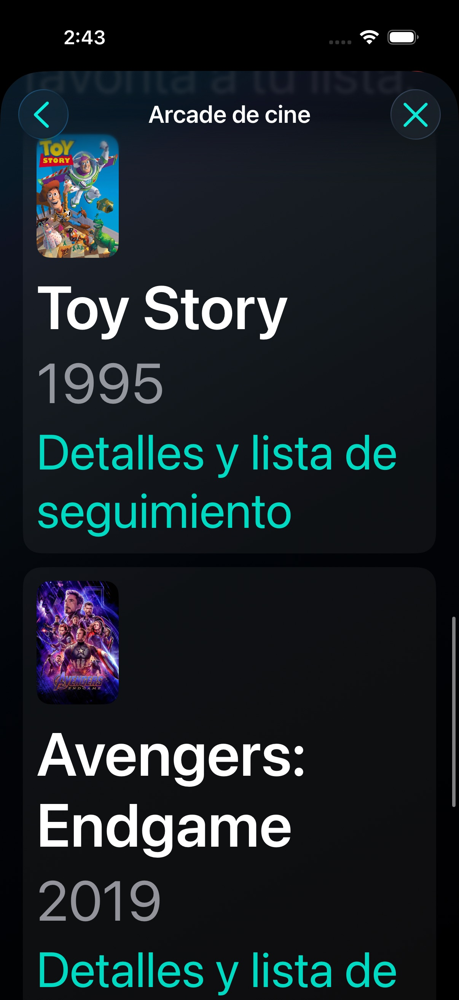
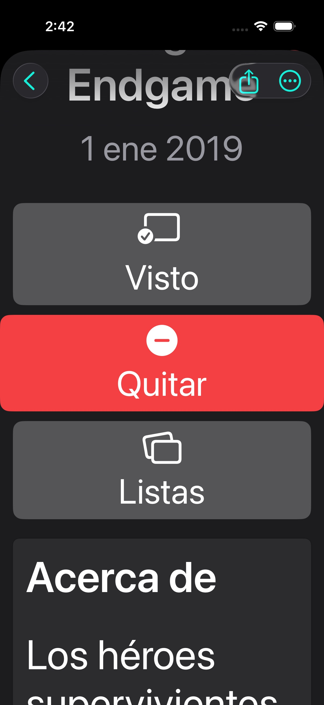

# Arcade discovery evidence

Synthetic XCTest playthroughs on iPhone 17 Pro / iOS Simulator 26.3.1. These screenshots and test results establish functional behavior, not human enjoyment, retention or revenue.

- `full-suite-summary.json`: 288 tests passed (283 unit tests plus five complete UI flows), zero failures/skips.
- `action-layout-summary.json`: two complete normal/Spanish accessibility flows passed after the final movie-detail action layout change; zero failures/skips.
- Attachment manifests retain original export filenames, test identifiers, device identity and screenshot names. Matching JPEGs are full-resolution format conversions of original screenshots. Normal save and Spanish screenshots use the final action-layout rerun; the others use the full-suite run.
- `initial-failure-summary.json`: the initial focused bundle intentionally retains its two persistence failures (22 tests passed, two failed). Missing-store exception recovery was then implemented and verified. Do not report this bundle as passing.
- `spanish-cards-before.jpg` and `spanish-actions-before.jpg`: screenshots of the narrow-column and truncated-label issues before the visual fixes.

Original bundles remain at `/private/tmp/arcade-discovery-final-2026-10-01.xcresult` and `/private/tmp/arcade-discovery-action-layout-2026-10-01.xcresult`.
