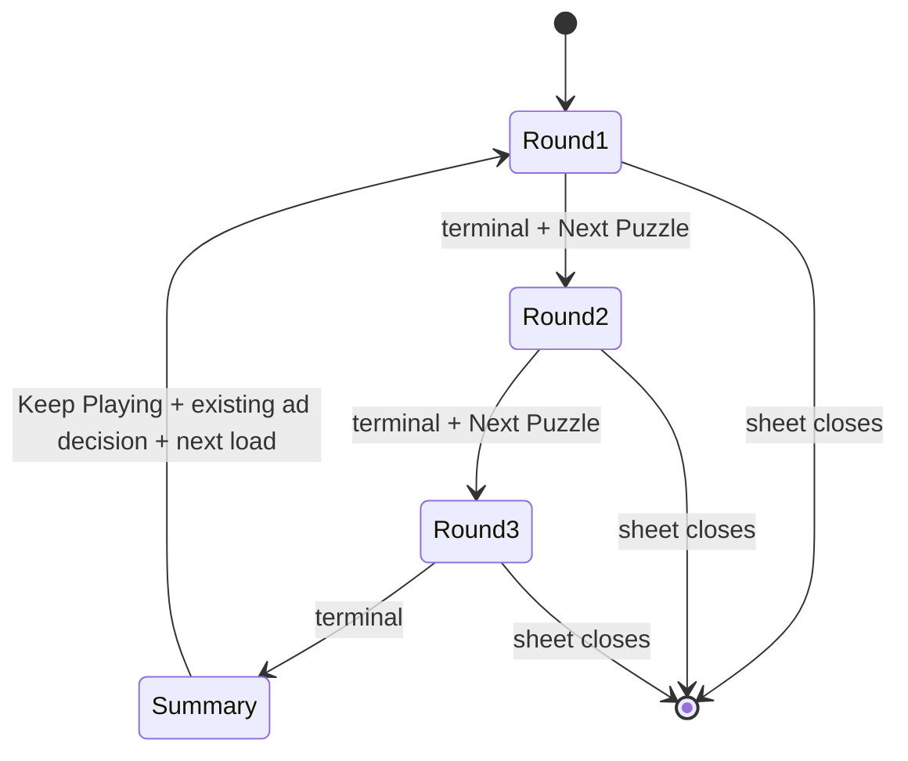

title: Daily Puzzle Three-Round Run
type: feat
status: active
date: 2026-08-27
origin: docs/brainstorms/2026-08-27-daily-puzzle-three-round-run-requirements.md

# Daily Puzzle Three-Round Run

## Overview

Turn continuous Daily Puzzle play into repeatable three-round runs with visible progress, a cumulative completion summary, shareable results, and run-level analytics. The existing user-initiated third-round interstitial decision remains unchanged.

## Problem Frame

Players can continue to another puzzle, but the loop lacks a short goal and session payoff. This plan adds a three-round structure that improves clarity and completion motivation while preserving current puzzle and monetization behavior (see origin: `docs/brainstorms/2026-08-27-daily-puzzle-three-round-run-requirements.md`).

## Requirements Trace

- R1-R4: visible and accessible round progress, terminal-round counting, existing early continuation, and a third-round summary.
- R5-R7: cumulative summary, Share Run, and Keep Playing into a new run.
- R8-R9: preserve current ad policy and keep partial state session-only.
- R10-R11: additive run-level telemetry without changing historical puzzle events.

## Scope Boundaries

- No backend, persistence, cross-device state, puzzle schema, dependency, ad-frequency, subscription, leaderboard, or multiplayer changes.
- Existing per-puzzle share and telemetry remain intact.

## Context & Research

### Relevant Code and Patterns

- `Shared/ViewModel/DailyPuzzleFeature.swift`: current puzzle state, idempotent analytics context, and event factories.
- `Shared/View/Navigation/HomeView.swift`: current Daily Puzzle sheet, terminal UI, Next Puzzle callback, and third-round ad decision.
- `CronicaTests/SettingsStoreTests.swift`: current Daily Puzzle view-model and analytics assertions.
- `docs/daily-puzzle-analytics-kpis.md`: canonical event and KPI definitions.

### Institutional Learnings

- Progression must remain explicit and testable; a previously observed solve-to-next failure made hidden continuation state unacceptable.
- AdMob show-rate constraints favor better session depth over additional ad requests.

## Key Technical Decisions

- Use a pure run-state value with idempotent puzzle recording: cumulative totals are testable without SwiftUI and duplicate view updates cannot double-count a round.
- Keep run state in the existing sheet lifecycle: version one intentionally resets when the sheet/app session ends.
- Keep HomeView continuation unchanged: `Keep Playing` uses the same callback and therefore the same cooldown, cap, no-inventory, and failure handling as `Next Puzzle`.
- Track run events additively: historical per-puzzle funnels remain comparable.

## High-Level Technical Design

> This state flow is directional guidance, not implementation specification.

## Implementation Units

- [ ] **Unit 1: Pure run state and cumulative summary**

**Goal:** Represent one three-round run, record terminal puzzles exactly once, calculate summary totals, and reset for the next run.

**Requirements:** R1-R5, R9

**Dependencies:** None

**Files:**
- Modify: `Shared/ViewModel/DailyPuzzleFeature.swift`
- Test: `CronicaTests/SettingsStoreTests.swift`

**Approach:**
- Add a small value type for target rounds, completed/solved counts, attempts, hints, recorded puzzle identities, displayed round, completion state, and share summary.
- Recording returns whether state changed so UI and analytics can remain idempotent.

**Execution note:** Implement the state behavior test-first.

**Test scenarios:**
- Happy path: three distinct terminal puzzles produce rounds 1/3 through 3/3 and accurate solved/attempt/hint totals.
- Edge case: recording the same puzzle twice does not change totals.
- Edge case: a failed terminal puzzle increments completed but not solved count.
- Happy path: starting the next run clears prior identities and totals and returns to round 1/3.
- Happy path: share text contains the aggregate score and no movie answer.

**Verification:** Pure state tests prove all transitions and totals without UI timing dependencies.

- [ ] **Unit 2: Additive run analytics**

**Goal:** Measure run starts, completions, shares, and post-completion continuation by build and session.

**Requirements:** R10-R11

**Dependencies:** Unit 1

**Files:**
- Modify: `Shared/ViewModel/DailyPuzzleFeature.swift`
- Test: `CronicaTests/SettingsStoreTests.swift`

**Approach:**
- Add run event factories and view-model tracking methods that inherit existing puzzle/common context.
- Include target/completed/solved/failed rounds, attempts, hints, and run sequence where applicable.

**Test scenarios:**
- Happy path: completion event reports three completed rounds with correct solved, failed, attempt, and hint metadata.
- Edge case: run start and share events preserve puzzle ID/index context.
- Compatibility: existing event names and metadata remain unchanged.

**Verification:** Focused analytics tests assert exact event names and decision-critical properties.

- [ ] **Unit 3: Progress, completion summary, sharing, and continuation UI**

**Goal:** Make the three-round structure visible and actionable inside the current Daily Puzzle sheet.

**Requirements:** R1-R8

**Dependencies:** Units 1-2

**Files:**
- Modify: `Shared/View/Navigation/HomeView.swift`
- Test: `CronicaTests/SettingsStoreTests.swift`

**Approach:**
- Own the pure run state in the sheet so it persists as successive puzzle view models replace one another.
- Record terminal state from view lifecycle changes and initial solved/failed presentation.
- Show accessible progress on every round.
- Keep `Next Puzzle` for rounds one and two; replace it with the cumulative summary, Share Run, and `Keep Playing` after round three.
- Reset only after the next puzzle successfully replaces the third-round puzzle.

**Patterns to follow:**
- Existing `dailyPuzzle.nextPuzzleCTA`, per-puzzle `ShareLink`, and async continuation loading state.

**Test scenarios:**
- Integration: solving rounds one and two leaves existing Next Puzzle behavior intact.
- Integration: third terminal round displays one summary and no automatic ad.
- Error path: failed next-puzzle fetch leaves the summary available for retry without clearing or double-counting totals.
- Integration: Keep Playing follows the existing third-round ad decision and the loaded puzzle begins a fresh round 1/3.
- Accessibility: progress and summary expose meaningful labels/values.

**Verification:** Simulator smoke test captures round progress, third-round summary, and fresh-run continuation.

- [ ] **Unit 4: KPI contract and rollout checkpoint**

**Goal:** Make the feature measurable and preserve a durable release decision record.

**Requirements:** R10-R11 and all success criteria

**Dependencies:** Units 1-3

**Files:**
- Modify: `docs/daily-puzzle-analytics-kpis.md`
- Modify: `docs/revenue-growth-scorecard.md`

**Approach:**
- Define run completion rate, run share rate, and completion-to-continue rate by build.
- Record implementation/test evidence and the TestFlight observation gate.

**Test scenarios:**
- Test expectation: none -- documentation defines the analytics contract and checkpoint evidence.

**Verification:** Event names map unambiguously to PostHog queries and release decisions.

## System-Wide Impact

- **Interaction graph:** puzzle terminal state updates run state; run state changes CTA/summary; continuation still enters HomeView’s existing ad/fetch callback.
- **Error propagation:** next-load failures retain the current terminal puzzle and complete summary.
- **State lifecycle risks:** duplicate SwiftUI updates must not double-count; sheet dismissal intentionally discards partial runs.
- **API surface parity:** archive puzzles are excluded from Daily Run state.
- **Integration coverage:** focused state/event tests plus simulator progression through all three rounds.
- **Unchanged invariants:** ad IDs, cooldowns, session caps, puzzle answer logic, backend content, and per-puzzle analytics do not change.

## Risks & Dependencies

| Risk | Mitigation |
|------|------------|
| SwiftUI re-renders record a puzzle more than once | Deduplicate by puzzle identity in pure state |
| State resets before a failed continuation retry | Reset only when a distinct next puzzle is loaded |
| New summary accidentally triggers an automatic ad | Keep monetization exclusively behind Keep Playing callback |
| Run telemetry duplicates historical events | Use new event names and retain all existing events |

## Documentation / Operational Notes

- Compare by-build run completion and continuation only after enough TestFlight/App Store exposure; do not infer from debug sessions because telemetry is disabled there.

## Sources & References

- **Origin document:** `docs/brainstorms/2026-08-27-daily-puzzle-three-round-run-requirements.md`
- Related code: `Shared/ViewModel/DailyPuzzleFeature.swift`
- Related UI: `Shared/View/Navigation/HomeView.swift`
- Related tests: `CronicaTests/SettingsStoreTests.swift`
