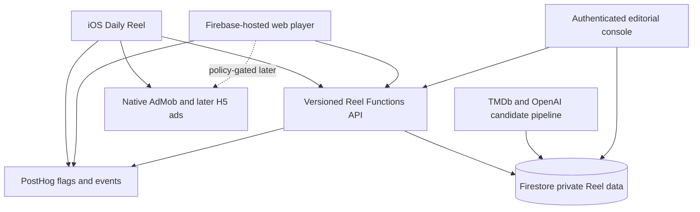
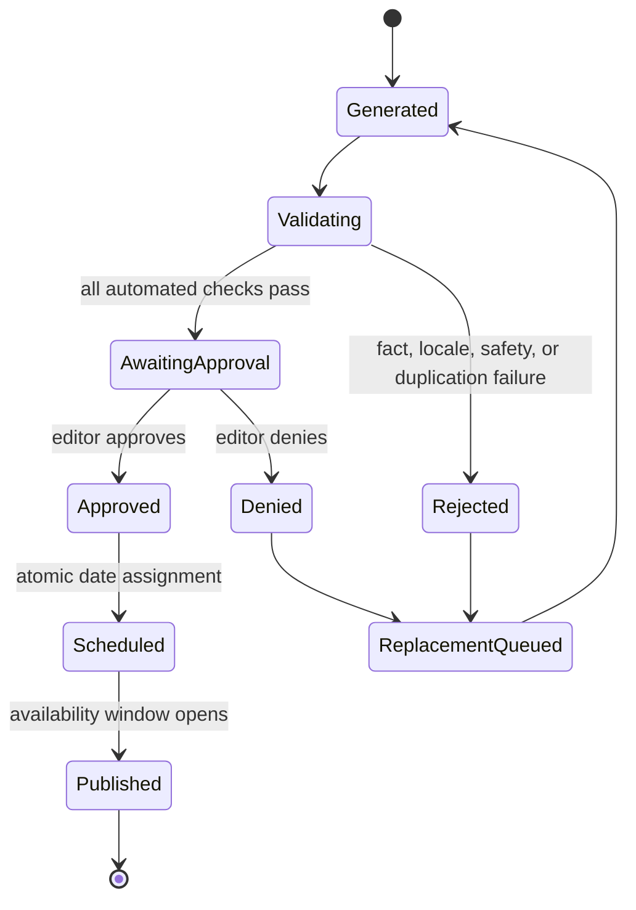
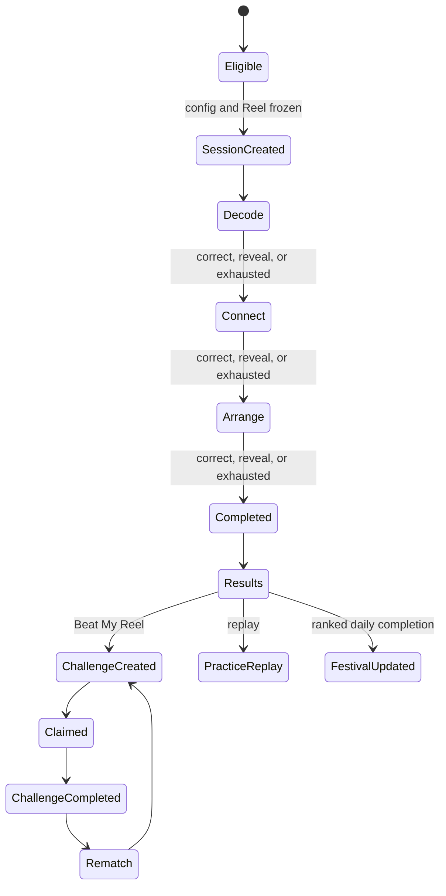
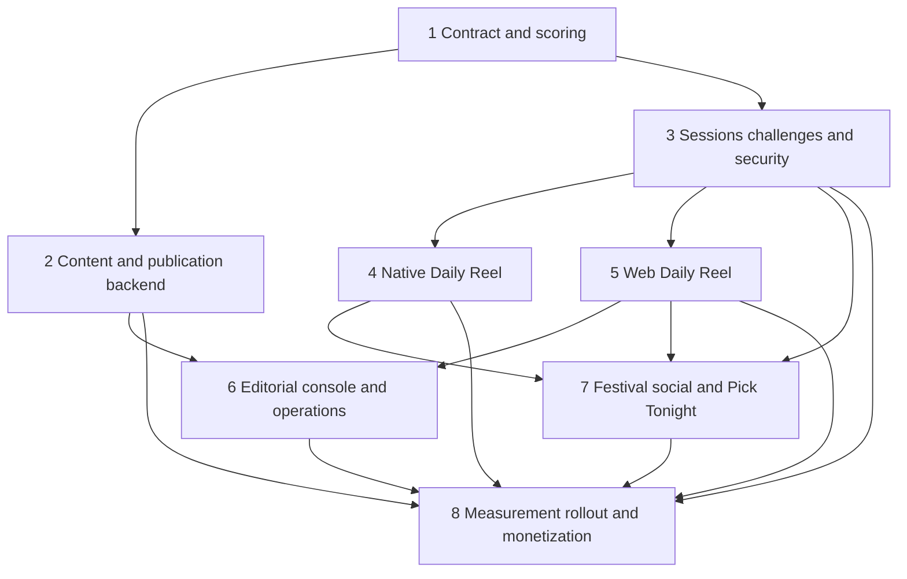

# Daily Reel: Cross-Platform Sticky Puzzle Product

## 1. Overview

Daily Reel evolves the existing three-round Daily Puzzle into one cohesive,
repeatable movie-game product on iOS and the web. Every published Reel contains
three fixed acts under one editorial theme:

| Act | Player action | Correct-answer shape |
| --- | --- | --- |
| Decode | Decode an emoji movie clue | One localized movie title or accepted alias |
| Connect | Pick the shared link among three films | One of four localized choices |
| Arrange | Order three films by release date | One exact earliest-to-latest ordering |

The product is completion-first rather than timer-first. It adds a weekly Film
Festival, permanent local badges, one earned Encore, and a spoiler-safe
one-to-one Beat My Reel challenge. The same immutable content, scoring rules,
and experiment configuration must govern native and web play.

This plan deliberately preserves the production Daily Puzzle path. Existing app
versions continue reading `dailyPuzzles`; Daily Reel is introduced through new
versioned content and session APIs behind PostHog flags. No existing production
document is migrated or overwritten as part of the launch.

### Outcome

The intended outcome is a more memorable daily habit with measurable paths from
starter to completion, return, social acquisition, and policy-safe revenue. The
implementation is complete only when it can answer, with absolute counts as
well as rates:

- Are more people starting and completing the daily game?
- Does Daily Reel improve D1 and D7 return without harming crash-free usage?
- Do Festival, Encore, and Beat My Reel create incremental sessions?
- Does increased engagement create more post-completion monetization without
  increasing interruptive ad pressure?
- Which locales, platforms, content themes, and experiment configurations
  produce durable gains?

### Operating principle

Every rollout checkpoint must produce one simple recommendation:

- `APPROVE`: all required evidence and guardrails pass; continue to the named
  next exposure level.
- `DENY`: at least one required gate fails; keep the current exposure and list
  only the blockers that must be corrected.

No checkpoint silently increases exposure or ad pressure.

## 2. Problem Frame

The current app has a measured three-round emoji puzzle loop, a five-day weekly
goal, rewarded hints, and post-completion ad opportunities. Those are useful
building blocks, but the product still has four structural limits:

| Limit | Consequence | Daily Reel response |
| --- | --- | --- |
| Every round is the same emoji mechanic | Sessions can feel repetitive | Three fixed acts with different cognitive actions |
| Progress is mostly individual and same-device | Few organic return or acquisition loops | Festival, Encore, Beat My Reel, and Rematch |
| iOS is the only playable surface | Shared links cannot convert without installation | Full no-install-wall web game |
| Puzzle truth and scoring are client-visible | Social scores are not defensible | Server-authoritative attempts and immutable sessions |

The app is also under active AdMob policy scrutiny. Daily Reel must increase
valuable sessions before considering additional ad frequency. Ads cannot cover
game controls, interrupt an act, or become required to finish.

## 3. Scope

### In scope

- A versioned Daily Reel contract for Decode, Connect, and Arrange.
- Five-localization content: English, French, Spain Spanish, Mexico Spanish, and
  Brazilian Portuguese.
- A 0-300 server-authoritative score and per-act results.
- Anonymous local progress on iOS and web, with explicit local-only disclosure.
- The five-distinct-Reels Film Festival, permanent badges, and one earned Encore.
- One-to-one, opaque, 48-hour Beat My Reel challenges and Rematch.
- A complete responsive web player with Today, challenge, results, Festival,
  badge, Encore, and Pick Tonight journeys.
- PostHog feature flags, coherent experiment assignments, and outcome telemetry.
- Candidate generation, validation, explicit approval, scheduling, fallback,
  queue health, and replacement on denial.
- Existing native rewarded help and post-completion ad opportunities, subject
  to the policy rules in this plan.
- Staged release, measurement, rollback, and operational documentation.

### Out of scope

- Accounts or cross-device progress synchronization.
- Game Center, public profiles, public leaderboards, or group multiplayer.
- Pair streaks, user-generated puzzles, premium packs, or subscriptions.
- A full movie-tracker/watchlist product on the web.
- Licensed video, audio, dialogue, or quote-based puzzle content.
- A separate kill-switch service outside PostHog feature flags.
- More frequent native interstitials or any web ad launch before its policy gate.

## 4. Requirements Trace

The origin document remains authoritative for DR1-DR42. This plan groups those
approved requirements by implementation concern rather than assigning new
numbers that could drift from the source.

| Origin requirement cluster | Plan coverage | Primary units |
| --- | --- | --- |
| Three fixed acts, one theme, completion-first progression | Contract, session state machine, native/web players | 1, 3, 4, 5 |
| 0-300 scoring, free title length, score-affecting help, reveal/fail | Shared fixtures and server scoring | 1, 3 |
| Frozen content/rules and iOS-web parity | Immutable versions, config snapshots, parity tests | 1, 3, 4, 5 |
| Results, weekly progress, Festival, badge, and Encore | Local progress model and engagement surfaces | 4, 5, 7 |
| Five locales and localized aliases, hints, choices, sharing | Content pipeline and client localization | 1, 2, 4, 5 |
| Beat My Reel, hidden sender score, rematch, and Pick Tonight | Capability challenges and result flows | 3, 7 |
| Full web game with no install wall | Firebase-hosted React application | 5, 7 |
| Automated candidates, explicit approval, denial replacement, safe fallback | Editorial state machine and console | 2, 6 |
| No in-act interruption and optional rewarded help | Shared placement policy and rollout gates | 4, 5, 8 |
| PostHog flags, concurrent coherent experiments, frozen challenge config | Experience resolver and analytics schema | 3, 4, 5, 8 |
| Sample-size rules and keep/change/expand/revert evidence | Audit scripts and rollout ledger | 8 |
| First-use guidance, accessibility, and complete failure states | Native/web UX acceptance coverage | 4, 5, 7 |
| Anonymous privacy and score integrity | Session APIs, data minimization, security controls | 3, 8 |
| Staged activation with explicit checkpoints | Rollout sequence and binary gates | 8 |

## 5. Success Criteria

### Functional acceptance

- A published Reel is immutable and contains all three acts in all five locales.
- The same scoring fixture produces the same score in Functions, Swift, and web
  tests.
- A player can finish all acts after mistakes, clue use, or reveal without being
  trapped in a dead end.
- A completed session returns per-act and total scores, assistance details,
  Festival progress, and applicable follow-up actions.
- A challenge never reveals the sender score before the claimed opponent finishes.
- A challenge stays pinned to the sender's Reel version, scoring version, and
  relevant experience configuration even after flags or content change.
- A fifth distinct weekly completion grants exactly one permanent local badge
  and one Encore entitlement.
- Existing app versions continue to receive the legacy Daily Puzzle payload.

### Quality and policy acceptance

- Public Reel payloads and browser bundles contain no correct answers, accepted
  aliases, answer order, admin credentials, or private PostHog tokens.
- No native or web full-screen ad appears between act start and final results.
- Rewarded help is explicitly requested, clearly describes the reward, and has
  a non-ad fallback when unavailable or declined.
- Dynamic Type, screen-reader labels, contrast, reduced motion, keyboard input,
  and non-drag Arrange input are covered by acceptance tests.
- Loading, empty, offline, invalid, expired, stale, rate-limited, and content-error
  states have explicit recovery actions.
- App Check enforcement is enabled only after monitor-mode metrics show valid
  clients will not be locked out.

### Measurement acceptance

- Every exposed user has a logged experience configuration before outcome events.
- Starter, act completion, Reel completion, challenge, Festival, and revenue
  events reconcile to backend/session facts within an agreed operational tolerance.
- Reports show absolute users/sessions beside rates and preserve platform,
  locale, Reel version, and configuration segmentation.
- A cohort decision waits for at least 100 unique Reel starters in each compared
  cohort and a complete D7 window.
- A provisional keep or expand decision requires a 10% or greater improvement
  in completion, D7 return, or revenue per starter, with no other primary metric
  or crash-free metric declining more than 5%.
- Results are described as directional, not statistically conclusive, unless a
  later analysis establishes stronger power.

## 6. Context and Research

### Current repository patterns

| Existing surface | Observed pattern | Planning consequence |
| --- | --- | --- |
| `Shared/Model/DailyPuzzle.swift` | Single emoji clue with localized accepted answers | Add a separate discriminated Reel model; do not mutate the legacy schema in place |
| `Shared/ViewModel/DailyPuzzleFeature.swift` | Puzzle state, run progress, archive, persistence, networking, and telemetry are concentrated in one large file | Put Daily Reel domain, stores, service, and view model in separate focused files |
| `Shared/View/Navigation/HomeView.swift` | Home owns the current card, sheet, next-puzzle flow, and ad handoffs | Keep integration thin; a Reel container owns its internal navigation |
| `Shared/Manager/CronicaTelemetry.swift` | Native PostHog capture and iOS session replay already exist | Extend the adapter and add a feature-flag coordinator rather than adding another analytics SDK |
| `Shared/Configuration/AdCoordinator.swift` | Rewarded and post-completion placements have cooldown and overlay guards | Route Reel opportunities through existing coordinator policy, never direct ad calls from act views |
| `functions/src/puzzleSchema.ts` and pipeline files | Zod validation, scheduled generation, TMDb grounding, Firestore repository, and Vitest coverage exist | Reuse the pipeline shape but isolate Reel documents and stricter fact validation |
| `dailyPuzzles/<date>` and `dailyPuzzles/latest` | Existing clients depend on mutable latest/date reads | Introduce new collections and APIs; preserve these documents unchanged |
| `scripts/posthog_audit.sh` | HogQL audits already reconcile run, weekly-goal, reward, and ad events | Add Daily Reel funnels and challenge/Festival cohorts to this established operational path |
| `docs/revenue-growth-scorecard.md` | Revenue work is evaluated as a measured loop, with low-volume caveats | Add Reel hypotheses, absolute counts, checkpoints, and explicit ad-pressure constraints |
| Root `firebase.json` | Functions are configured, but Hosting is not | Add one Firebase Hosting target for the static web app and API rewrites |

### Official vendor guidance that shapes the design

| Source | Design implication |
| --- | --- |
| [Firebase Hosting configuration](https://firebase.google.com/docs/hosting/full-config) | Use SPA rewrites for player routes and explicit Function rewrites for versioned APIs |
| [Firebase Hosting use cases](https://firebase.google.com/docs/hosting/use-cases) | A static React/Vite app fits the current project without introducing a full server-rendered platform |
| [Firebase App Check for Apple custom resources](https://firebase.google.com/docs/app-check/ios/custom-resource) | Native requests attach App Check tokens to protected session and challenge APIs |
| [Firebase App Check custom backend verification](https://firebase.google.com/docs/app-check/custom-resource-backend) | Functions verify tokens server-side and use limited-use protection on abuse-sensitive mutations |
| [PostHog iOS SDK](https://posthog.com/docs/libraries/ios) | Keep native capture, feature flags, anonymous identity, and replay in the installed SDK |
| [PostHog feature flag code](https://posthog.com/docs/feature-flags/adding-feature-flag-code) | Resolve variants and payloads once per session, cache safely, and capture exposure before outcomes |
| [PostHog React integration](https://posthog.com/docs/libraries/react) | Use one web provider and hooks/adapters rather than direct flag calls throughout components |
| [Google rewarded-ad policy](https://support.google.com/adsense/answer/9121589) | Rewarded help must be opt-in, clearly disclosed, dismissible, and actually grant the promised help |
| [Google H5 Games ad placement](https://support.google.com/adsense/answer/9959170) | If web ads are later approved, use game-aware placements only at natural transitions |
| [Google accidental-click guidance](https://support.google.com/adsense/answer/2768340) | Keep ads away from navigation, answer controls, and rapidly changing game surfaces |

### Institutional constraints carried forward

- The existing measured loop already established a three-round run, five-day
  weekly target, guarded rewarded hints, and post-completion monetization.
- Current production volume is small enough that rates without absolute counts
  can be misleading.
- Ad request and impression volume, not interstitial frequency, has been the
  primary monetization constraint.
- AdMob policy remediation takes precedence over adding pressure.
- Simulator builds normally disable production telemetry; live telemetry and
  replay proof must come from TestFlight or an explicitly supported configuration.

## 7. Resolved During Planning

### 7.1 Compatibility boundary

Daily Reel uses new `/v1/reels` APIs and new Firestore collections. Legacy
`dailyPuzzles` handlers, payloads, and documents remain available. Old clients
are not required to understand Reel acts, scoring versions, or sessions.

### 7.2 Web architecture

Create a React, TypeScript, and Vite single-page application under `web/`, hosted
by Firebase Hosting. Functions remain the sole trusted backend. Clients do not
read or write Reel Firestore documents directly.

This wins over a server-rendered framework because the product is interaction-
heavy, public pages do not require authenticated server rendering, and the repo
already uses Firebase Functions. A generic challenge preview is acceptable for
the first release; dynamic Open Graph rendering can be added after challenge
conversion is measured.

### 7.3 Contract and scoring authority

Published prompts are sanitized projections of immutable private Reel versions.
Correct answers, accepted aliases, and release-order truth remain server-side.
Every scored answer is submitted to a session endpoint; the server calculates
assistance counts, act score, progression, and final score.

### 7.4 Attempt and reveal semantics

Each act permits three incorrect submissions. A correct answer after zero, one,
or two assistance events scores 100, 75, or 50. The third incorrect submission
exhausts the act, reveals the answer, awards zero, and advances. An explicit
Reveal action also awards zero and advances. A score-affecting clue counts as
one assistance event. Decode's title-length clue is free and idempotent.

### 7.5 Replay semantics

The first completed ranked session for an anonymous installation, Reel version,
and mode is canonical for daily credit and challenge creation. A local replay is
allowed as non-ranked practice but cannot improve Festival credit or replace a
previously shared score. Rematch creates a new frozen challenge session rather
than mutating the original result.

### 7.6 Date and week semantics

The backend assigns a canonical `publicationId` and availability window. Clients
never decide which server document is today's authoritative Reel by changing
their clock. Festival progress records the device's local ISO-week key at the
time a server-confirmed completion receipt is stored; later timezone changes do
not move historical credit between weeks.

### 7.7 Anonymous identity and local progress

iOS and web each generate a random local installation identity. The backend
stores only a keyed hash where deduplication is needed; PostHog receives an
anonymous distinct ID, not a fabricated identified user. Clearing browser data
or reinstalling the app can reset progress, which the UI discloses. No account,
profile, email, ad identifier, or cross-device history is created.

### 7.8 Challenge capability model

A challenge is an opaque, high-entropy, single-opponent capability valid for 48
hours. The raw token exists only in the share URL fragment and local secure or
browser session storage; Firestore stores a one-way token hash. A shared link has
the shape `https://<game-host>/c#<capability>` so Hosting, referrer headers, and
normal page-path analytics never receive the bearer value. The client consumes
and removes the fragment before initializing PostHog. The first non-creator
installation to start atomically claims the challenge. Before that opponent
finishes, challenge reads omit the sender score. After completion, both
participants can retrieve the result through locally retained capabilities. No
push notification is required.

### 7.9 Feature-flag coherence

PostHog is the source of rollout and experiment assignments. A top-level
`daily-reel-rollout` flag controls eligibility. Compatible per-surface flags are
resolved once into a validated `experienceConfig` and stable `configId`. The
server snapshots the scoring-affecting subset when creating a session. Challenge
sessions use the sender's frozen snapshot and log `assignmentSource=challenge`
instead of reevaluating current flags.

The resolver uses cached flags when available and a versioned baseline when
PostHog is temporarily unavailable. On iOS, a first-time user with no valid flag
result remains on legacy Daily Puzzle. A public web route with no eligible
assignment shows a recoverable unavailable state rather than starting an
unmeasured configuration.

### 7.10 Offline behavior

Previously fetched prompts and local progress may render offline. Scored answers
cannot be accepted offline because answers are intentionally absent from clients.
The UI preserves the current act and input, explains that verification requires
a connection, and retries with an idempotency key. A resumed session returns the
server's authoritative state.

### 7.11 Editorial authority

Normal generated content never publishes without explicit approval. Approval
creates or selects an immutable version and atomically assigns it to a schedule
date. Denial is terminal for that candidate and immediately queues a replacement.
Only pre-approved evergreen inventory may fill an empty slot automatically.

### 7.12 Web monetization boundary

The first public web player ships without ads. Web monetization is a later gated
slice requiring account/site eligibility, consent implementation, policy review,
and H5 Games placement proof. Native Daily Reel may use the existing explicit
rewarded-help and post-completion opportunity; it does not add a new placement.

## 8. Deferred Configuration Decisions

These items do not block contract, backend, client, or test implementation. They
must be supplied before the corresponding rollout checkpoint.

| Decision | Needed by | Safe default until resolved |
| --- | --- | --- |
| Canonical public gameplay host and associated-domain value | Web challenge rollout | Use environment-specific Hosting URL; do not advertise universal-link behavior |
| External approval-reminder destination | Editorial operations rollout | Show queue warning in the console and emit one deduplicated operational log per day |
| Google H5 Games/AdSense eligibility and placement IDs | Web monetization checkpoint | Do not load a web ad SDK or request ads |
| Final privacy-policy wording for web analytics, local progress, and optional ads | Public web rollout | Block public promotion until reviewed copy is linked |
| Dynamic social-preview host/function | Post-MVP challenge optimization | Use spoiler-free generic metadata and client-rendered challenge details |
| Final visual art direction and badge assets | Native/web UI implementation | Use the established Streaming Now color language and accessible system symbols in functional builds |

## 9. High-Level Technical Design

The following diagrams are directional. Field names and module boundaries may be
adjusted during implementation, but the trust and compatibility boundaries are
requirements.

### 9.1 Component interaction



### 9.2 Publication lifecycle



Approved and published versions are immutable. Correcting one creates a new
candidate/version and an explicit schedule change with an audit record.

### 9.3 Scored play lifecycle



### 9.4 Trust boundary and API projections

| Projection | May contain | Must never contain |
| --- | --- | --- |
| Published prompt | Localized theme, emojis, choices, film display metadata, clue availability, version IDs | Correct title, accepted aliases, correct choice ID, correct ordering |
| Session state | Current act, attempt count, unlocked clues, score already earned, server transition token | Future-act answers or sender score before challenge completion |
| Attempt response | Correct/incorrect, remaining attempts, updated assistance count, reveal after terminal outcome | Match internals or unused accepted aliases |
| Completed result | Per-act outcome, scores, assistance summary, Festival receipt, next actions | Installation identity, internal moderation data, hidden opponent fields |
| Admin candidate | Full answer truth, validation evidence, all locales, scheduling state | Runtime secrets or personal analytics tokens |

### 9.5 Proposed API surface

| Operation | Responsibility | Protection |
| --- | --- | --- |
| `GET /v1/reels/today` | Return eligible sanitized publication metadata | App Check monitor then enforce; cacheable public projection |
| `POST /v1/reel-sessions` | Resolve/freeze config and start or resume a ranked session | App Check, rate limit, idempotency |
| `GET /v1/reel-session` | Resume server-authoritative state | Session capability in redacted authorization header, App Check |
| `POST /v1/reel-session/attempts` | Validate one answer and advance state transactionally | Authorization capability, App Check, sequence and request IDs |
| `POST /v1/reel-session/assists` | Unlock free or score-affecting assistance | Authorization capability, App Check, idempotency |
| `POST /v1/reel-session/reveal` | End current act with zero and return reveal data | Authorization capability, App Check, idempotency |
| `POST /v1/challenges` | Create a challenge from a completed authoritative session | Completed-session capability, App Check, rate limit |
| `POST /v1/challenge-resolution` | Resolve spoiler-safe challenge state or completed comparison | Capability in non-logged request body, App Check where available |
| `POST /v1/challenge-claims` | Atomically bind the first opponent and create a frozen session | Capability in non-logged request body, App Check, rate limit, idempotency |
| `GET /v1/reels/archive` | Return sanitized approved archive entries for Encore | App Check; pagination |
| `GET /v1/admin/reel-candidates` | List queue cards and locale/fact checks | Firebase Auth plus admin authorization |
| `POST /v1/admin/reel-candidates/{id}/approve` | Create immutable version and schedule it | Auth, admin claim/allowlist, audit record, idempotency |
| `POST /v1/admin/reel-candidates/{id}/deny` | Deny and queue replacement | Auth, admin claim/allowlist, audit record, idempotency |

Mutation CORS is restricted to configured Hosting origins. Existing legacy GET
handlers retain their current behavior. Session capabilities never appear in URL
paths or query strings, and request/error logging redacts authorization headers,
challenge bodies, nicknames, and submitted answers. Error envelopes use stable
machine codes so native and web can map the same recovery action without parsing
messages.

### 9.6 Proposed data ownership

| Store | Purpose | Lifecycle |
| --- | --- | --- |
| `dailyReelCandidates` | Mutable generated draft, validation evidence, locale previews, audit state | Retain for editorial audit; exclude from public APIs |
| `dailyReelVersions` | Immutable private content and answer truth | Permanent while referenced by schedules, sessions, or archive |
| `dailyReelSchedule` | Canonical publication date to immutable version mapping | Permanent audit history; changes create explicit revisions |
| `dailyReelEvergreen` | Pre-approved fallback inventory | Reusable only under documented duplication/cooldown rules |
| `dailyReelSessions` | Frozen config, act state, score ledger, hashed anonymous identity | Unfinished sessions expire after the documented resume window; completed operational records expire after 30 days; receipt survives locally |
| `dailyReelChallenges` | Hashed capability, creator result reference, opponent claim, expiration | Claims close after 48 hours; delete nickname and challenge record after a documented result-retrieval grace period |
| Native local store | Identity, resumable capability, completion receipts, badges, Encore | Device-local until app data is removed |
| Web local store | Identity, resumable capability, completion receipts, badges, Encore | Browser-local until site data is cleared |

No public client receives direct Firestore credentials beyond normal Firebase
application configuration. All sensitive reads and writes pass through Functions.

### 9.7 Experience configuration

The normalized configuration contains only versioned, allowlisted behavior. It
does not accept arbitrary PostHog payload fields as executable rules.

| Configuration area | Examples | Freeze rule |
| --- | --- | --- |
| Contract | Reel schema version, scoring version | Freeze for every session |
| Progression | Act order, max attempts, reveal behavior | Freeze for every session |
| Assistance | Free clue visibility, rewarded-help copy/availability | Freeze scoring effect; UI availability may fail safely |
| Results | Rematch prominence, Pick Tonight treatment | Freeze for challenges only when comparison UX depends on it |
| Festival | Target count, Encore grant | Versioned locally and on completion receipt |
| Presentation | Non-scoring copy or animation treatment | May follow current compatible flag outside a challenge |

The resolver rejects unknown scoring versions, incompatible flag combinations,
and payloads that would add an in-act ad. Rejected configurations fall back to
the last known validated baseline and emit an operational error event.

## 10. Cross-Platform Flow Analysis

### 10.1 Today's Reel

Entry points are the native Home card, native Daily Reel deep link, web home,
and direct `/reel/today` URL. Eligibility is resolved before a scored session is
created. First-time players see skippable instructions and a non-scoring example.

The happy path is Decode -> Connect -> Arrange -> Results. Every act terminates
through correct, explicit reveal, or third failed attempt. The server transition
is authoritative. Closing the app or tab preserves the session capability and
returns to the current server act.

Terminal states are completed results, temporarily offline with Retry, no
published content with Try Again, or ineligible rollout with the existing Daily
Puzzle/native unavailable web treatment.

### 10.2 Beat My Reel sender

The sender enters from completed results, optionally enters a locally remembered
nickname, and creates an opaque challenge from that completed session. The share
sheet/link never includes the score or answer. The sender's local outgoing list
polls only while visible and reports pending, claimed, completed, or expired.

If local capabilities are lost, the result cannot be recovered because there is
no account. The UI states this limitation without offering false synchronization.

### 10.3 Beat My Reel opponent

The opponent opens the HTTPS `/c#<capability>` link in the installed app when
universal links are configured, otherwise in the web player. The app consumes
the fragment locally; the web bootstrap stores it for the current browser session,
removes it from browser history, and initializes analytics only afterward. The
preview names the sender only if a safe optional nickname exists and withholds
the score. Starting atomically claims the one-opponent challenge. A simultaneous
second claimant receives a stable already-claimed state and a Today/Rematch path
rather than a generic error.

Expired, malformed, revoked, self-opened, already-completed, and rate-limited
links each have distinct non-spoiler outcomes. The opponent result reveals both
scores only after server-confirmed completion.

### 10.4 Festival and Encore

Each authoritative completion receipt can add at most one distinct publication
to the local week's set. Practice replay and repeat challenge completions for the
same publication do not add credit. At five, the client atomically records the
badge and one Encore entitlement.

Encore selection reserves an archived Reel but consumes the entitlement only
after its first authoritative completion. Abandoning or losing connectivity does
not burn the reward. A completed Encore may create a challenge but does not add
another Festival credit for an already-counted publication.

### 10.5 Editorial approval

An authorized editor sees the oldest approval-ready candidate with English facts
first and one-click locale previews. Approve assigns the intended date only if it
is still unoccupied. Deny permanently marks the candidate and queues a replacement
without requesting a reason. Concurrent editor actions return the committed
state and cannot double-schedule or resurrect a denied candidate.

If fewer than seven approved future dates remain, one daily deduplicated warning
appears. If a date reaches publication without a scheduled approved version, the
publisher chooses an eligible pre-approved evergreen Reel. It never publishes a
merely validated generated draft.

### 10.6 Pick Tonight

Pick Tonight appears below Rematch on completed results. It uses the player's
current provider region, not a hard-coded US region. Native can route to existing
movie/watchlist/provider surfaces. Web can show current provider/deep-link choices
without implementing a synchronized watchlist. Missing provider data produces a
neutral movie-detail action, not an empty or broken CTA.

## 11. Edge-Case Defaults

| Scenario | Required behavior |
| --- | --- |
| Duplicate attempt request after timeout | Return the original result for the idempotency key; do not increment assistance twice |
| Out-of-order act or stale sequence | Return authoritative session state and ask client to reconcile |
| PostHog unavailable at new native install | Show legacy Daily Puzzle; do not create a Reel exposure/session |
| PostHog changes after session starts | Keep the session's frozen config |
| Flag configuration is unknown/incompatible | Use validated baseline and emit configuration error; never execute arbitrary payload behavior |
| App/web closes mid-act | Restore server state and locally preserved unsent input where safe |
| Network drops during answer submission | Keep controls pending, retry with same request ID, then reconcile server result |
| Offline before session exists | Show cached preview only and require connection to start ranked play |
| Third incorrect answer | Reveal, score zero for the act, and advance |
| Rewarded ad unavailable or declined | Offer the normal score-affecting clue path; never block progress |
| Native ad overlay or consent UI is present | Suppress Reel post-completion placement through existing coordinator |
| Challenge clicked by creator | Show sender status/share management; do not claim as opponent |
| Two opponents claim simultaneously | Firestore transaction grants the first; later caller sees already claimed |
| Challenge expires during active opponent session | A session claimed before expiry may finish within its session grace window; new claims fail |
| Sender changes nickname later | Existing challenge keeps its sanitized frozen nickname |
| Browser storage is cleared | Start a new local identity and disclose that prior progress cannot be recovered |
| Device timezone changes | Historical Festival week keys stay unchanged |
| Same Reel completed through daily and challenge | One Festival credit for that publication |
| Approved candidate conflicts with occupied date | Do not overwrite; return conflict for editor resolution |
| Generation fails repeatedly | Backoff, alert queue health, and use only eligible pre-approved fallback |
| Locale text is missing | Candidate cannot enter approval-ready state |
| Provider region has no offers | Show movie detail/search fallback and log availability category only |

## 12. Output Structure

The final file layout should keep new concerns out of the already-large legacy
feature and Home view.

```text
contracts/
  daily-reel/v1/
    schemas/
    fixtures/

functions/src/
  dailyReelSchema.ts
  dailyReelScoring.ts
  dailyReelGenerator.ts
  dailyReelQuality.ts
  dailyReelRepository.ts
  dailyReelPipeline.ts
  dailyReelExperience.ts
  dailyReelSessions.ts
  dailyReelChallenges.ts
  dailyReelSecurity.ts
  dailyReelHandlers.ts
  dailyReelAdminHandlers.ts

Shared/
  Model/DailyReel.swift
  Manager/DailyReelService.swift
  Manager/DailyReelExperimentCoordinator.swift
  Manager/DailyReelProgressStore.swift
  ViewModel/DailyReelViewModel.swift
  View/DailyReel/

web/
  public/
  src/
    admin/
    analytics/
    api/
    app/
    domain/
    game/
    progress/
    social/
    styles/
  tests/

docs/
  daily-reel-architecture.md
  daily-reel-content-operations.md
  daily-reel-rollout-ledger.md

scripts/
  daily_reel_release_gate.sh
```

Names may be adjusted to existing project conventions, but the separation of
legacy Daily Puzzle, Reel domain, web UI, editorial tooling, and operations must
remain visible.

## 13. Implementation Dependency Graph



Units 2 and 3 can proceed in parallel after Unit 1. Native and web can proceed
in parallel after the session contract is stable. Editorial publishing remains
shadow-only until Unit 6 provides explicit approval. No public exposure begins
until Unit 8's applicable gate is implemented.

## 14. Implementation Units

## Unit 1: Versioned Contract, State Machine, and Scoring Fixtures

### Purpose

Create one inspectable behavioral contract that Functions, Swift, and web can
implement independently without drifting. This unit establishes immutable IDs,
localized content shape, sanitized public projections, session transitions, and
the exact 0-300 score.

### Files

Create:

- `contracts/daily-reel/v1/schemas/published-reel.schema.json`
- `contracts/daily-reel/v1/schemas/session-state.schema.json`
- `contracts/daily-reel/v1/schemas/experience-config.schema.json`
- `contracts/daily-reel/v1/fixtures/published-reel.json`
- `contracts/daily-reel/v1/fixtures/scoring-cases.json`
- `contracts/daily-reel/v1/fixtures/session-transitions.json`
- `functions/src/dailyReelSchema.ts`
- `functions/src/dailyReelScoring.ts`
- `functions/src/dailyReelSchema.test.ts`
- `functions/src/dailyReelScoring.test.ts`
- `Shared/Model/DailyReel.swift`
- `CronicaTests/DailyReelContractTests.swift`

Modify:

- `Story.xcodeproj/project.pbxproj`

### Approach

Use a discriminated act model with fixed roles `decode`, `connect`, and
`arrange`. Every Reel carries a contract version, immutable content version,
scoring version, canonical publication ID, localized theme, and localized act
projection. Private answer truth is represented only in backend validation
models; public fixture files demonstrate only sanitized payloads.

Encode scoring as data-driven fixture cases rather than prose-only tests. Count
wrong submissions and score-affecting clues as assistance events. Make free
title length, duplicate clue requests, duplicate network retries, and result
reads score-neutral. A terminal reveal or exhausted act always scores zero.

Define stable error categories for unavailable content, invalid locale,
unsupported contract, stale transition, expired capability, rate limit, and
temporary service failure. Clients map categories to localized recovery UI.

Keep `DailyPuzzle` and its current decoding untouched. No compatibility adapter
may reinterpret a Reel as a legacy puzzle during this unit.

### Test scenarios

| Scenario | Expected result |
| --- | --- |
| Valid three-act fixture in each supported locale | Schema accepts it and each locale projects all required player-facing fields |
| Public fixture inspection | No accepted answer, correct choice, correct order, or admin field is present |
| Correct with no assistance | Act score is 100 |
| One wrong answer then correct | Act score is 75 |
| One requested score-affecting clue then correct | Act score is 75 |
| One wrong answer plus one clue then correct | Act score is 50 |
| Two wrong answers then correct | Act score is 50 |
| Explicit reveal or third incorrect answer | Act score is 0 and next act becomes current |
| Free title-length clue requested repeatedly | Assistance count and score remain unchanged |
| Duplicate idempotent transition fixture | State and score change once |
| Missing Spain Spanish or malformed Arrange order | Schema rejects publication |
| Legacy Daily Puzzle fixture | Existing model still decodes without Reel fields |

### Verification outcome

Functions and Swift consume the same contract fixtures and agree on every
scoring and transition case. The contract is ready for the web runtime to join
in Unit 5.

### Dependencies

None.

## Unit 2: Candidate Generation, Quality, Scheduling, and Publication Backend

### Purpose

Produce a safe supply of complete five-locale Reels while preserving explicit
editorial control and a pre-approved fallback path.

### Files

Create:

- `functions/src/dailyReelGenerator.ts`
- `functions/src/dailyReelQuality.ts`
- `functions/src/dailyReelRepository.ts`
- `functions/src/dailyReelPipeline.ts`
- `functions/src/dailyReelAdminHandlers.ts`
- `functions/src/dailyReelGenerator.test.ts`
- `functions/src/dailyReelQuality.test.ts`
- `functions/src/dailyReelRepository.test.ts`
- `functions/src/dailyReelPipeline.test.ts`
- `functions/src/dailyReelRepository.integration.test.ts`

Modify:

- `functions/src/index.ts`
- `functions/src/tmdb.ts`
- `functions/src/openaiClient.ts`
- `functions/src/coverageSchedule.ts`
- `functions/src/adminConfig.ts`
- `functions/package.json`
- `functions/README.md`

### Approach

Follow the existing generator -> quality -> repository -> pipeline shape, but
generate one Daily Reel candidate rather than one emoji clue. Ground actor,
director, franchise, genre, and release-order facts in TMDb data before language
generation. Treat subjective theme links as editorial assertions that require
clear evidence in the approval card.

Generate English source content first, then French, Spain Spanish, Mexico Spanish,
and Brazilian Portuguese. Each locale includes display titles, accepted Decode
aliases held privately, hints, Connect choices, result explanations, and sharing
copy. Quality checks cover fact truth, answer uniqueness, answer leakage, locale
completeness, profanity/safety, duplicate recent films, duplicate recent themes,
difficulty bounds, and character limits.

Implement the candidate state machine and immutable publication records from the
technical design. Approval and denial endpoints exist here, but scheduled
publication remains shadow-only until the authenticated console in Unit 6 is
available. Use Firestore transactions for schedule assignment and denial/requeue.

Maintain at least 14 approved future dates. Queue health below seven creates one
deduplicated daily operational warning. The publisher can fill a missing date
only from pre-approved evergreen inventory that passes cooldown and duplication
checks at selection time.

### Test scenarios

| Scenario | Expected result |
| --- | --- |
| TMDb-grounded actor or director connection | Candidate stores evidence and quality validation passes |
| Invented relationship or wrong release order | Candidate is rejected before approval-ready state |
| All five locales complete | Candidate can become approval-ready |
| Any required locale or accepted alias set missing | Candidate remains blocked with actionable validation evidence |
| Decode answer duplicates Connect/Arrange answer intent | Candidate is rejected for low variety |
| Recently used film/theme violates cooldown | Candidate is rejected or regenerated |
| Two editors approve the same candidate/date | One transaction commits; the other receives committed/conflict state |
| Editor denies candidate | Candidate becomes terminally denied and exactly one replacement is queued |
| Publisher sees no scheduled Reel | It selects only an eligible pre-approved evergreen version |
| No eligible fallback exists | Publication reports unavailable and emits an alert; no unapproved draft is published |
| Queue remains below seven across repeated scheduler runs | At most one warning is recorded per day |
| Pipeline retries after transient TMDb/OpenAI failure | Retry is bounded and idempotent; no duplicate candidate is scheduled |

### Verification outcome

The backend can maintain and validate a shadow queue, prove five-locale content,
and publish only immutable approved versions. No production client is exposed yet.

### Dependencies

Unit 1.

## Unit 3: Server-Authoritative Sessions, Feature Configuration, and Challenges

### Purpose

Establish the trusted runtime for scoring, resumption, frozen experiments, and
spoiler-safe social play.

### Files

Create:

- `functions/src/dailyReelExperience.ts`
- `functions/src/dailyReelSessions.ts`
- `functions/src/dailyReelChallenges.ts`
- `functions/src/dailyReelSecurity.ts`
- `functions/src/dailyReelHandlers.ts`
- `functions/src/dailyReelExperience.test.ts`
- `functions/src/dailyReelSessions.test.ts`
- `functions/src/dailyReelChallenges.test.ts`
- `functions/src/dailyReelSecurity.test.ts`
- `functions/src/dailyReelSessions.integration.test.ts`
- `functions/src/dailyReelChallenges.integration.test.ts`

Create or modify:

- `firestore.indexes.json`

Modify:

- `functions/src/index.ts`
- `functions/src/dailyReelRepository.ts`
- `functions/package.json`
- `functions/README.md`
- `firebase.json`

### Approach

Create opaque session capabilities and store only one-way hashes. Carry session
bearer values in a dedicated authorization header that infrastructure and app
logging explicitly redact; never place them in a URL. Carry challenge capabilities
only in non-logged request bodies after local fragment consumption. A start request
resolves the PostHog rollout and compatible experiment flags, validates the
normalized config against an allowlist, freezes the required values, and returns
the first sanitized act. The backend never trusts client score, attempt count,
completion state, Reel version, or arbitrary flag payloads.

Each mutation includes a request ID and expected transition sequence. Firestore
transactions enforce one current act, one terminal result per act, one ranked
daily completion, and one claimed opponent. Duplicate requests return their
previous outcome. Stale requests return the authoritative state without applying
an extra mistake.

Protect mutations with Firebase App Check, monitor metrics before enforcement,
and add bounded per-capability and per-anonymous-install rate limits. Use limited-
use App Check tokens where replay protection is warranted. Do not persist raw IP
addresses as product identity.

Create a challenge only from a completed authoritative session. Generate a
high-entropy raw token, store its hash, freeze the sender result/config, sanitize
the optional nickname, and set a 48-hour claim expiry. Claiming uses one Firestore
transaction. A claimed session may finish within a short configured grace window
even if the original claim deadline passes.

Use Firestore indexes only for documented repository queries and configure TTL
cleanup for session and challenge operational records. Completed session records
have a 30-day operational window; challenge claims close at 48 hours and challenge
records/nicknames are removed after the documented result-retrieval grace period.
Keep aggregate analytics in PostHog, not an undeclared user profile table.

### Test scenarios

| Scenario | Expected result |
| --- | --- |
| Eligible anonymous start | Server freezes known Reel/scoring/config versions and returns only Decode prompt |
| Flag disabled or user outside rollout | No scored session is created |
| PostHog timeout with validated cached assignment | Cached configuration starts and exposure source is recorded |
| Unknown or incompatible flag payload | Validated baseline is used and an operational error is emitted |
| Correct/wrong/clue/reveal sequence | Server state and score match Unit 1 fixtures |
| Same request ID retried | One assistance/transition is recorded and identical response is returned |
| Stale sequence or wrong act submitted | No score mutation; current authoritative state is returned |
| Client submits a fabricated score or completion | Field is ignored/rejected and server result remains authoritative |
| Session resumed on the same local identity | Current act, attempts, clues, and earned score are restored |
| Public prompt and network response inspection | No future or current answer truth leaks |
| Session/challenge request and error-log inspection | No capability, answer, nickname, or authorization value is logged |
| Challenge created from incomplete/fabricated session | Request is rejected |
| Challenge preview before opponent completion | Sender score is absent |
| Two opponent claims race | Exactly one claims; the other receives already-claimed state |
| Creator opens own token | Creator cannot become opponent and sees sender state |
| Token expires before claim | Claim fails with localized expired path |
| Token expires after valid claim | Existing opponent may finish during grace period |
| Feature flags change after challenge creation | Opponent session uses frozen sender config |
| Nickname contains control characters, excessive length, or blocked content | Server normalizes, truncates, substitutes, or rejects without storing unsafe text |
| Invalid App Check token after enforcement | Protected mutation fails without changing state |
| Rate limit exceeded | Stable retryable error is returned; no partial write occurs |

### Verification outcome

The emulator-backed API proves score integrity, answer secrecy, idempotent state
transitions, single-opponent claims, and frozen challenge parity before any UI is
connected.

### Dependencies

Unit 1. Unit 2 must supply at least one approved fixture publication for full
integration verification.

## Unit 4: Native Daily Reel Domain, UI, Persistence, and Integration

### Purpose

Deliver the complete core Reel on iOS while keeping legacy Daily Puzzle as the
flag-off control and reusing current telemetry, consent, routing, and ad policy.

### Files

Create:

- `Shared/Manager/DailyReelService.swift`
- `Shared/Manager/DailyReelExperimentCoordinator.swift`
- `Shared/Manager/DailyReelProgressStore.swift`
- `Shared/ViewModel/DailyReelViewModel.swift`
- `Shared/View/DailyReel/DailyReelContainerView.swift`
- `Shared/View/DailyReel/DailyReelInstructionsView.swift`
- `Shared/View/DailyReel/DailyReelActHeaderView.swift`
- `Shared/View/DailyReel/DailyReelDecodeView.swift`
- `Shared/View/DailyReel/DailyReelConnectView.swift`
- `Shared/View/DailyReel/DailyReelArrangeView.swift`
- `Shared/View/DailyReel/DailyReelResultsView.swift`
- `Shared/View/DailyReel/DailyReelStateView.swift`
- `CronicaTests/DailyReelServiceTests.swift`
- `CronicaTests/DailyReelExperimentCoordinatorTests.swift`
- `CronicaTests/DailyReelProgressStoreTests.swift`
- `CronicaTests/DailyReelViewModelTests.swift`

Modify:

- `Shared/Manager/CronicaTelemetry.swift`
- `Shared/Configuration/Key.swift`
- `Shared/Configuration/StreamingNowApp.swift`
- `Shared/Configuration/AdCoordinator.swift`
- `Shared/View/Navigation/HomeView.swift`
- `Shared/Resources/Localizable.xcstrings`
- `Story.xcodeproj/project.pbxproj`
- `CronicaTests/AdCoordinatorTests.swift`
- `CronicaTests/AdGatingTests.swift`
- `CronicaUITests/CronicaUITests.swift`

### Approach

Add a dedicated service for API requests and App Check tokens, a coordinator for
PostHog flags/config normalization, a compact local persistence layer, and one
view model that mirrors server session state. Do not add Reel behavior to the
legacy `DailyPuzzleViewModel` or expand Home with act-level state.

The Home card switches to Daily Reel only after an eligible flag result. Flag-off,
timeout-without-cache, or unsupported-contract users retain the existing Daily
Puzzle. The Reel sheet/container owns instructions, act progression, errors,
results, and dismissal/resumption.

Decode uses localized text input and server validation. Connect uses four large
choice controls. Arrange supports drag, tap-to-select/tap-to-place, keyboard or
switch control, and explicit move-up/move-down accessibility actions. All acts
support Dynamic Type without clipping, VoiceOver labels/hints, reduced motion,
high contrast, and orientation/size-class changes.

Persist the anonymous identity, session capability, unsent input, completion
receipts, badge state, Encore state, and outgoing challenge capabilities locally.
Do not put raw answer text, optional nickname, challenge token, or provider query
into PostHog properties.

Route rewarded help through the current ad coordinator. A rewarded offer may
appear only after the player asks for help and the UI explains the exact clue.
If no ad can show, unlock the normal score-affecting clue path without blocking.
The only interstitial/native opportunity is after the final result through the
existing completion policy; all act views set the current overlay/gameplay guard.

Add a versioned HTTPS challenge route handler alongside the existing custom daily
puzzle route. Configure universal links only after the canonical host is known.

### Test scenarios

| Scenario | Expected result |
| --- | --- |
| Rollout flag off | Existing Daily Puzzle card and behavior remain unchanged |
| Eligible flag/config | Home card opens Daily Reel and logs exposure before start |
| First Reel open | Skippable instructions and non-scoring example appear once |
| Returning/reopened session | Current server act and local unsent input restore |
| Decode alias accepted by server | Correct state advances without client answer knowledge |
| Connect mistake then correct | Assistance UI and result score match server |
| Arrange with drag and non-drag controls | Both produce the same submitted order |
| Third failure or Reveal | Answer explanation appears and Next Act remains available |
| Offline before answer submission | Input remains, Retry is visible, and no local score is fabricated |
| Timeout after submission then retry | Same request ID reconciles one server transition |
| Unsupported contract or stale session | Recoverable state offers refresh/restart without crash |
| Rewarded ad unavailable/declined | Player can still obtain normal help and continue |
| Ad overlay/consent UI present | No Reel post-completion placement is requested |
| Act 1 or Act 2 completes | No interstitial opportunity is requested |
| Final results complete under existing policy | At most the existing eligible post-completion opportunity is requested |
| Largest Dynamic Type and narrow layout | Prompts, choices, score, and progression remain readable |
| VoiceOver Arrange | Film order and move actions are understandable without drag |
| Reduced Motion enabled | Act transitions avoid nonessential motion |
| Session replay/analytics payload audit | No answer text, nickname, capability, or hidden score appears in captured properties |
| Existing `dailyPuzzle.*` UI smoke flow | Legacy identifiers and Next Puzzle control still work for control users |

### Verification outcome

An internal iOS build can complete all three acts, resume safely, produce the
server score, preserve legacy control behavior, and show no in-act ad. Native
feature exposure and outcome events are observable in a supported telemetry build.

### Dependencies

Units 1 and 3. A shadow approved Reel from Unit 2 is needed for end-to-end use.

## Unit 5: Full Web Daily Reel Product

### Purpose

Make every shared Reel playable in a browser without an installation wall while
preserving the same contract, accessibility, privacy, and session authority as iOS.

### Files

Create:

- `web/package.json`
- `web/package-lock.json`
- `web/tsconfig.json`
- `web/vite.config.ts`
- `web/index.html`
- `web/public/.well-known/apple-app-site-association`
- `web/src/main.tsx`
- `web/src/app/bootstrapChallenge.ts`
- `web/src/app/App.tsx`
- `web/src/app/router.tsx`
- `web/src/api/dailyReelApi.ts`
- `web/src/analytics/posthog.tsx`
- `web/src/domain/dailyReel.ts`
- `web/src/domain/scoringFixtures.test.ts`
- `web/src/progress/localProgress.ts`
- `web/src/game/ReelGame.tsx`
- `web/src/game/DecodeAct.tsx`
- `web/src/game/ConnectAct.tsx`
- `web/src/game/ArrangeAct.tsx`
- `web/src/game/ReelResults.tsx`
- `web/src/game/ReelState.tsx`
- `web/src/styles/tokens.css`
- `web/src/styles/app.css`
- `web/tests/reel-core.spec.ts`
- `web/tests/reel-accessibility.spec.ts`
- `web/tests/reel-responsive.spec.ts`

Modify:

- `firebase.json`
- `.firebaserc`
- `README.md`

### Approach

Build a route-based React/Vite application with Today, challenge, results,
Festival, badge, Encore, privacy, and optional post-result App Store CTA routes.
Use Firebase Hosting SPA rewrites for client routes and explicit `/v1/**` rewrites
to the Functions API. Environment-specific public Firebase/PostHog application
configuration is injected at build time; personal API tokens and admin secrets
never enter the bundle.

Bootstrap `/c` before analytics: consume the capability from the URL fragment,
store it only for the browser session, replace browser history with the token-free
route, and only then initialize PostHog, page views, replay, and normal routing.
Sanitize all captured URLs and referrers defensively. Native performs the same
consume-before-capture ordering when opening a universal link.

Implement one API adapter, one PostHog provider/feature coordinator, and one local
progress store. Use the same JSON fixtures from Unit 1 for runtime contract and
scoring parity tests. App Check uses the supported web provider and moves from
monitor to enforcement with the backend gate.

Design for phone, tablet, and desktop intentionally rather than scaling the iOS
sheet. Keep the three acts visually related through one Reel/festival language,
but make each mechanic spatially distinct. Use semantic headings, form labels,
focus management, live regions for answer outcomes, keyboard-operable Arrange,
visible focus, reduced motion, and contrast-compliant states.

The public launch contains no web ad SDK. The results page may show a secondary
App Store CTA after Rematch and Pick Tonight; it never blocks results or challenge
creation. Add privacy copy that explains anonymous analytics, browser-local
progress, and data-clearing consequences.

### Test scenarios

| Scenario | Expected result |
| --- | --- |
| Each Unit 1 contract/scoring fixture | Web parser and display state agree with backend/Swift expectations |
| Direct load of `/reel/today` | Hosting fallback boots the correct route without a 404 |
| Direct valid challenge URL | Spoiler-free preview loads and can claim/play without installation |
| Challenge bootstrap and telemetry inspection | Capability is absent from browser history, referrer, pageview, replay metadata, and API URL |
| Ineligible/flag unavailable route | Recoverable unavailable state appears; no untracked session starts |
| Complete Decode, Connect, Arrange | Server-authoritative results and total display match native |
| Browser refresh mid-act | Capability restores current server state |
| Browser offline during submission | Input remains and retry reuses idempotency key |
| Keyboard-only play | Every act, reveal, result, share, and follow-up control is operable |
| Screen reader play | Act context, choices, errors, ordering, and score changes are announced meaningfully |
| Small phone, tablet, and wide desktop | Controls remain readable and no horizontal answer-control overflow occurs |
| Reduced motion preference | Nonessential transitions are removed |
| Local storage cleared | New identity starts and prior-progress limitation is disclosed |
| Bundle/network inspection | No private answer data, personal PostHog token, admin secret, or web ad request exists |
| Results page | Rematch is primary, Pick Tonight follows, App Store CTA is optional/secondary |

### Verification outcome

A Hosting preview can complete the same fixture-backed Reel and challenge flow as
iOS across phone and desktop sizes, with no installation requirement and no ads.

### Dependencies

Units 1 and 3. Unit 2 supplies approved content.

## Unit 6: Editorial Approval Console and Content Operations

### Purpose

Turn the shadow content pipeline into a sustainable, explicit, low-friction
approval operation without exposing admin authority to public clients.

### Files

Create:

- `web/src/admin/AdminAuthBoundary.tsx`
- `web/src/admin/ReelQueuePage.tsx`
- `web/src/admin/ReelCandidateCard.tsx`
- `web/src/admin/ReelLocalePreview.tsx`
- `web/src/admin/ReelSchedulePage.tsx`
- `web/src/admin/ReelQueueHealth.tsx`
- `web/src/admin/reelAdminApi.ts`
- `web/tests/reel-admin.spec.ts`
- `docs/daily-reel-content-operations.md`

Modify:

- `web/src/app/router.tsx`
- `functions/src/dailyReelAdminHandlers.ts`
- `functions/src/dailyReelPipeline.ts`
- `functions/src/dailyReelRepository.ts`
- `functions/src/dailyReelSecurity.ts`
- `functions/src/index.ts`
- `firebase.json`

### Approach

Use Firebase Authentication for the console and verify an admin custom claim or
server-side allowlist on every admin endpoint. Hiding routes in React is not an
authorization control. Public Reel clients cannot invoke approval actions.

The primary queue card shows theme, all three acts, source movies, fact evidence,
difficulty indicators, duplication warnings, and English content. Locale previews
switch among all five locales without changing approval state. The only normal
decisions are Approve and Deny. Approve schedules the intended date and reports
the committed immutable version. Deny immediately requests a replacement and
does not require a reason.

Show future approved-day count, gaps, fallback inventory, publication status,
and the once-daily under-seven warning. External reminder delivery is an adapter
configured later; the console warning and deduplicated operational event are the
required baseline.

Document normal approval, conflict recovery, denial, fallback replenishment,
locale correction, schedule revision, emergency disable through PostHog rollout,
and audit review. The document must state that generated-but-unapproved content
cannot be published manually as a shortcut.

### Test scenarios

| Scenario | Expected result |
| --- | --- |
| Unauthenticated or non-admin user opens admin route/API | Access is denied without candidate data leakage |
| Admin opens queue card | English facts and validation evidence are visible before locale previews |
| Admin switches every locale | Complete localized prompts, aliases summary, hints, choices, and sharing preview appear |
| Approve once | Date is atomically scheduled and immutable version/audit record are visible |
| Approve is retried | Same committed state returns; no duplicate publication is created |
| Date was filled concurrently | Clear conflict appears; existing schedule is not overwritten |
| Deny once or retry | Candidate remains denied and exactly one replacement is queued |
| Queue has fewer than seven approved dates | Warning appears once per day and queue depth is measurable |
| Queue has 14 or more approved dates | Warning clears and no reminder event is emitted |
| Empty publication slot | Only eligible pre-approved evergreen content can fill it |
| Admin bundle inspection | No server secret, personal API token, or answer data is available to public routes |

### Verification outcome

An authorized editor can approve or deny with one decision, maintain a 14-day
queue, and prove exactly which immutable content will publish. Unauthorized users
cannot inspect or mutate candidates.

### Dependencies

Units 2 and 5.

## Unit 7: Festival, Encore, Beat My Reel UX, Rematch, and Pick Tonight

### Purpose

Complete the sticky and social loops on both platforms after the core game and
challenge authority are stable.

### Files

Create:

- `Shared/Model/DailyReelChallenge.swift`
- `Shared/Model/DailyReelFestival.swift`
- `Shared/Manager/DailyReelChallengeStore.swift`
- `Shared/View/DailyReel/DailyReelFestivalView.swift`
- `Shared/View/DailyReel/DailyReelBadgeView.swift`
- `Shared/View/DailyReel/DailyReelEncoreView.swift`
- `Shared/View/DailyReel/DailyReelChallengeView.swift`
- `Shared/View/DailyReel/DailyReelChallengeResultView.swift`
- `Shared/View/DailyReel/DailyReelPickTonightView.swift`
- `CronicaTests/DailyReelFestivalTests.swift`
- `CronicaTests/DailyReelChallengeStoreTests.swift`
- `web/src/progress/FestivalPage.tsx`
- `web/src/progress/BadgePage.tsx`
- `web/src/progress/EncorePage.tsx`
- `web/src/social/ChallengePage.tsx`
- `web/src/social/ChallengeResult.tsx`
- `web/src/social/RematchAction.tsx`
- `web/src/social/PickTonight.tsx`
- `web/tests/reel-engagement.spec.ts`
- `web/tests/reel-challenge.spec.ts`

Modify:

- `Shared/Manager/DailyReelService.swift`
- `Shared/Manager/DailyReelProgressStore.swift`
- `Shared/View/DailyReel/DailyReelResultsView.swift`
- `Shared/Configuration/StreamingNowApp.swift`
- `Shared/Resources/Localizable.xcstrings`
- `Story.xcodeproj/project.pbxproj`
- `CronicaUITests/CronicaUITests.swift`
- `web/src/app/router.tsx`
- `web/src/game/ReelResults.tsx`
- `web/src/progress/localProgress.ts`
- `web/src/analytics/posthog.tsx`

### Approach

Apply completion receipts idempotently to a local ISO-week ledger. Count distinct
publication IDs only. On the fifth completion, create a permanent themed badge
and one unconsumed Encore entitlement. Reserve an Encore selection locally and
consume it only after authoritative completion. Surface the local-only limitation
where progress is explained, not as a surprise after data loss.

Add Beat My Reel to results with optional sanitized nickname and platform-native
sharing. The link and share text reveal neither score nor answer. Direct links
open the challenge preview, claim once, and use the frozen config. Sender and
opponent result surfaces poll only while visible, stop at terminal state, and use
backoff to avoid unnecessary Functions reads.

Place Rematch as the primary completed-challenge action. Rematch creates a new
challenge capability and never reopens the prior score. Place Pick Tonight below
Rematch. Resolve providers by current user region and use existing native movie
and watchlist paths; web offers provider/movie detail without implying synced
watchlist state.

Add event capture at each meaningful transition, but exclude nickname, raw share
token, answer text, typed input, and provider query strings.

### Test scenarios

| Scenario | Expected result |
| --- | --- |
| Four distinct ranked Reel receipts in local week | Festival shows 4/5 and no badge/Encore |
| Fifth distinct receipt applied twice | One badge and one Encore are awarded exactly once |
| Practice replay or duplicate publication challenge | No extra Festival credit |
| Timezone changes after prior credit | Historical week ledger remains stable |
| Encore selected then app/tab closes before completion | Entitlement remains reserved and unconsumed |
| Encore completed | Entitlement is consumed once and result may create a challenge |
| Challenge share text/link | Capability exists only in the fragment and is absent from share analytics, score/answer copy, and hidden result fields |
| Recipient opens before completion | Sender score remains hidden |
| Recipient finishes | Both scores and outcome become visible through authorized capabilities |
| Sender checks pending/completed status | Polling occurs only on visible status screen and stops at terminal state |
| Expired/claimed/malformed/self-opened challenge | Each gets its specified recovery path without spoilers |
| Rematch tapped | New challenge is created with a new capability and frozen current sender result |
| Pick Tonight with regional providers | Current region options appear and action routes correctly |
| Pick Tonight without providers | Stable movie-detail/search fallback appears |
| Web user has no app | Full challenge and result flow remains playable; App Store CTA is secondary |
| French, Spain Spanish, Mexico Spanish, and Brazilian Portuguese | Festival, badge, challenge, share, and Pick Tonight text is localized |

### Verification outcome

iOS and web demonstrate the complete daily -> Festival -> Encore and result ->
challenge -> rematch loops with matched behavior, no spoiler leakage, and no
account dependency.

### Dependencies

Units 3, 4, and 5.

## Unit 8: Telemetry, Release Gates, Continuous Improvement, and Monetization

### Purpose

Make Daily Reel operable as a measured growth system rather than a one-time
feature launch. This unit creates the evidence needed for every `APPROVE` or
`DENY` checkpoint.

### Files

Create:

- `scripts/daily_reel_release_gate.sh`
- `docs/daily-reel-architecture.md`
- `docs/daily-reel-rollout-ledger.md`

Modify:

- `scripts/posthog_audit.sh`
- `scripts/posthog_saved_insights.json`
- `docs/revenue-growth-scorecard.md`
- `docs/marketing_iterations.md`
- `docs/admob_policy_remediation.md`
- `README.md`
- `Shared/Manager/CronicaTelemetry.swift`
- `web/src/analytics/posthog.tsx`
- `functions/src/dailyReelHandlers.ts`

### Approach

Define one canonical event dictionary and property allowlist shared by native,
web, backend reconciliation, and reporting. Capture exposure once before the first
outcome for each resolved flag. Capture server facts for starts, transitions,
completion, and challenge terminal states so client events can be reconciled
without logging answers.

Required product events include:

- `daily_reel_exposed`
- `daily_reel_started`
- `daily_reel_act_viewed`
- `daily_reel_attempt_submitted`
- `daily_reel_assist_requested`
- `daily_reel_rewarded_help_offered`
- `daily_reel_rewarded_help_started`
- `daily_reel_rewarded_help_completed`
- `daily_reel_rewarded_help_unavailable`
- `daily_reel_act_completed`
- `daily_reel_completed`
- `daily_reel_results_viewed`
- `daily_reel_festival_progressed`
- `daily_reel_badge_awarded`
- `daily_reel_encore_reserved`
- `daily_reel_encore_completed`
- `daily_reel_challenge_created`
- `daily_reel_challenge_opened`
- `daily_reel_challenge_claimed`
- `daily_reel_challenge_completed`
- `daily_reel_challenge_result_viewed`
- `daily_reel_rematch_tapped`
- `daily_reel_pick_tonight_tapped`
- `daily_reel_app_store_cta_tapped`
- `daily_reel_error`

Allowed common properties include platform, app/web version, locale, region,
publication ID, Reel version, scoring version, config ID, assignment source,
act role, attempt number, assistance category/count, score bucket, challenge age
bucket, and stable error code. Disallowed properties include typed answer, correct
answer, accepted aliases, nickname, capability/token, free-form text, email,
advertising ID, raw provider query, and hidden opponent score.

Initialize analytics only after challenge-fragment consumption. Add property and
URL sanitizers as defense in depth, disable automatic capture on admin routes,
and redact session authorization and challenge bodies from Functions logs.

Extend the existing PostHog audit to report exposure -> start -> each act ->
completion -> result -> challenge/rematch and exposure -> weekly return -> Festival
-> Encore funnels. Every rate includes numerator, denominator, unique users,
sessions, and locale/platform/config splits. Add revenue per active user, revenue
per Reel starter, impressions per starter, show rate, eCPM, CTR, rewarded-help
acceptance, and post-completion opportunity rate using AdMob data where available.

Record hypotheses and outcomes in the revenue scorecard. The rollout ledger stores
date, build/web deployment, flags, exposure, absolute counts, rates, crash-free
guardrail, content queue health, policy state, data gaps, attribution caveats,
and the binary recommendation.

Keep the `POSTHOG_API_TOKEN` in ignored local/server environment configuration.
It is used only by audit/administrative tooling and never embedded in Swift or web.

For native monetization, prove that all existing Reel opportunities remain after
completion and honor consent, cooldown, caps, and overlay suppression. Do not add
frequency while request/impression volume is the constraint. For web, create no
ad code until Google eligibility, consent, and H5 Games policy gates pass. The
later implementation must still use explicit rewarded help and natural post-game
transitions only.

### Test and audit scenarios

| Scenario | Expected result |
| --- | --- |
| Eligible flag exposure followed by start | One exposure precedes outcomes and carries config/assignment source |
| Challenge uses frozen config | Events carry challenge config and `assignmentSource=challenge` |
| Client retries an attempt | Product funnel counts one server transition, not duplicate assistance |
| Event allowlist audit | No answer, nickname, capability, free-form input, email, or ad ID is present |
| Challenge-link analytics and replay audit | No fragment capability appears in page URL, referrer, event, replay metadata, or server log |
| Native simulator run | Production analytics absence is expected and labeled, not treated as proof |
| TestFlight/supported telemetry run | Exposure, act, completion, and replay evidence can be retrieved |
| Backend/client reconciliation | Starts and completions match within documented tolerance; discrepancies are surfaced |
| Cohort under 100 starters or before D7 | Recommendation remains `DENY` for expansion due to insufficient evidence |
| Primary metric improves at least 10% with guardrails intact | Provisional keep/expand is allowed with directional caveat |
| Any other primary/crash-free metric falls more than 5% | Expansion is denied pending diagnosis |
| Queue below seven, answer leak, or locale gap | Public exposure gate is denied regardless of engagement metrics |
| In-act ad request observed | Release gate fails immediately |
| Web ad eligibility or consent proof absent | Web remains ad-free |
| Ad requests/impressions remain primary constraint | Recommendation cannot be increased interstitial pressure |

### Verification outcome

One audit produces a complete exposure, conversion, activation, retention,
social, and monetization view with absolute counts, caveats, and one binary
recommendation. The release gate can prevent publication/exposure when content,
integrity, privacy, accessibility, analytics, crash, or ad-policy evidence fails.

### Dependencies

Units 2 through 7. Instrumentation contracts should be introduced alongside
each earlier unit, then finalized and reconciled here.

## 15. Staged Activation and Checkpoints

### Checkpoint A: Contract and threat boundary

Required evidence:

- Cross-runtime fixtures define all acts, score paths, and transitions.
- Public projections contain no answer truth.
- Legacy Daily Puzzle compatibility is characterized.
- Session, capability, App Check, idempotency, and rate-limit designs are documented.

`APPROVE` advances to shadow content/backend work. `DENY` blocks all client work
that would depend on an unstable or answer-leaking contract.

### Checkpoint B: Shadow content and backend

Required evidence:

- At least 14 approved future Reels exist in all five locales.
- Every fact and release order has validation evidence.
- Denial replacement, schedule conflict, and evergreen fallback are proven.
- Session and challenge emulator tests prove score integrity and hidden scores.
- App Check monitor-mode metrics are available; enforcement is not premature.

`APPROVE` enables internal client flags only. `DENY` keeps generation and APIs in
shadow mode.

### Checkpoint C: Internal iOS and web parity

Required evidence:

- The same selected Reel completes with matching scores on iOS and web.
- First-use, accessibility, resume, offline, error, and expired-link flows pass.
- PostHog exposure and outcomes appear in a supported telemetry environment.
- No answer/nickname/capability leaks in payloads, logs, analytics, or replay.
- No in-act ad request occurs and the web bundle is ad-free.
- Native crash-free and web error baselines show no blocking regression.

`APPROVE` allows a small core-Reel cohort. `DENY` keeps the product internal.

### Checkpoint D: Core Daily Reel cohort

Scope:

- Decode, Connect, Arrange, results, local resumption, and current native
  post-completion policy.
- No Festival/Encore or social promotion is needed to evaluate core completion.

Required evidence:

- At least 100 unique starters per compared cohort and a full D7 window.
- Absolute act drop-off, completion, return, crash-free, and revenue/starter counts.
- Content difficulty segmented by act, locale, and publication.
- No content queue or policy regression.

`APPROVE` keeps the better core configuration and enables social/Festival slices.
`DENY` changes content difficulty or mechanic treatment before expanding.

### Checkpoint E: Beat My Reel and web acquisition

Required evidence:

- Challenge create -> open -> claim -> complete -> rematch counts and conversion.
- Sender score remains hidden until opponent completion.
- One-opponent claim, expiry, rematch, and provider fallback are proven in production-like use.
- Web visitors can complete without an install wall.
- App Store CTA is measured separately from game completion.

`APPROVE` expands the social slice when it adds completed Reels or qualified app
acquisition without harming completion. `DENY` keeps core Reel and revises the
share/preview/rematch loop.

### Checkpoint F: Festival, Encore, and return loop

Required evidence:

- Festival progress, fifth-completion conversion, badge awards, Encore reservation,
  Encore completion, and weekly return are reconciled with absolute counts.
- Duplicate receipts, timezones, replays, and local-data disclosure behave correctly.
- D7 return or rounds per active session improves without completion/crash regression.

`APPROVE` expands the engagement package. `DENY` keeps the core/social winners and
changes the weekly reward presentation or threshold only through a new flag cohort.

### Checkpoint G: Monetization

Native required evidence:

- Reel increases starters/completions or qualified post-completion opportunities.
- Existing ad show rate, impressions, eCPM, CTR, revenue per active user, and
  revenue per Reel starter are known.
- AdMob policy state is clear and no in-act/overlay placement occurs.

Web required evidence:

- Google site/H5 eligibility is confirmed.
- Consent and privacy handling is reviewed for targeted regions.
- Test placements are limited to explicit rewarded help and natural post-results transitions.
- Controls and navigation remain separated from ads.

`APPROVE` may activate the already-designed policy-safe placement for an explicit
cohort. `DENY` leaves the platform ad-free/current-pressure and continues to grow
starter and completion volume.

## 16. System-Wide Impact

### Interfaces and entry points

- Home chooses legacy Daily Puzzle or Daily Reel only at the feature boundary.
- Reel internal navigation does not add act state to Home.
- Existing `qscanlite://daily-puzzle` behavior remains; a new HTTPS challenge
  route is additive.
- Functions exports retain all legacy handlers and add versioned Reel handlers.
- Firebase Hosting owns browser routes and forwards only explicit API paths.
- Admin endpoints require server authorization independent of UI routing.

### State and consistency

- Published content and scoring/config snapshots are immutable.
- Firestore transactions protect act sequence, schedule assignment, challenge
  claim, canonical completion, and denial replacement.
- Idempotency keys protect retries across mobile networks and browser refreshes.
- Local progress applies signed/server-confirmed receipts once.
- Flags are evaluated before session creation and cannot mutate active scoring.

### Failure propagation

- PostHog failure defaults to legacy/ineligible or a validated cached baseline;
  it never allows arbitrary config.
- TMDb/OpenAI failure affects future candidate supply, not active published play.
- Firestore/API failure preserves current client state and does not invent score.
- App Check enforcement failure is observable in monitor mode before blocking users.
- Provider lookup failure degrades only Pick Tonight.
- Ad failure degrades only the optional ad path and never game assistance/progression.

### Performance and cost

- Fetch one sanitized Reel/session projection rather than all private content.
- Resolve flags once per normal session and reuse the frozen configuration.
- Use bounded writes per attempt and idempotent transactions; avoid per-frame or
  per-keystroke analytics/network calls.
- Poll challenge status only while its screen is visible with exponential backoff.
- Cache immutable public Reel projections by version while keeping session
  responses private and non-cacheable.
- Measure Functions reads/writes and challenge polling before broad rollout.

### Privacy and security

- No account or stable public profile is introduced.
- Nicknames are optional, short-lived, sanitized, and excluded from analytics.
- Capabilities are high entropy, one-way hashed at rest, scoped, expiring, carried
  in authorization headers or request bodies, and removed from shared URL state
  before analytics initialization.
- App Check, rate limits, auth, CORS allowlists, and transactional state protect
  public and admin mutations.
- PostHog event allowlists and replay masking prevent free-form/hidden data capture.
- Web privacy and consent copy is a public-launch gate.

### Release and rollback

- Backend additions deploy without switching legacy clients.
- Web can deploy to a preview channel before public Hosting promotion.
- Native ships with Daily Reel flag-off by default.
- Rollback uses PostHog rollout/experiment flags and preserves active frozen
  challenge sessions; no separate kill-switch service is added.
- Disabling new starts must not invalidate already-claimed challenge completion.
- Content publication can fall back only to approved evergreen inventory.

## 17. Risks and Mitigations

| Risk | Impact | Mitigation |
| --- | --- | --- |
| Scope spans backend, iOS, web, content, analytics, and ads | Large release can hide failures | Ship through isolated units and staged flags; do not activate all loops together |
| Public payload or logs leak answers/capabilities | Social score and game integrity collapse | Private/public projections, fragment bootstrap, header/body redaction, fixture inspection, server validation, bundle/network/log audits |
| Client or replay attack fabricates score | Challenges become meaningless | Server-owned state, sequence checks, idempotency, App Check, rate limits, capability expiry |
| Anonymous identity is reset or spoofed | Progress loss and limited anti-abuse | Disclose local-only behavior, hash local IDs, accept no-account limitation, rate-limit capabilities |
| PostHog flag combinations drift | Users enter incoherent experiences | Compatibility registry, normalized config ID, validated baseline, frozen sessions |
| Challenge link is shared broadly | Unexpected claimant wins race | Single atomic claimant, spoiler-safe claimed state, rematch path |
| Locale translation is technically complete but culturally poor | International completion suffers | Editorial locale previews, aliases, difficulty segmentation, per-locale holdback |
| Automated facts are wrong | Trust and solvability suffer | TMDb grounding, deterministic release-order checks, approval evidence, immutable corrections |
| Queue runs dry | Missing daily content | 14-day target, under-seven warning, pre-approved evergreen inventory only |
| Session writes/polling raise Firebase cost | Revenue gains are offset | Bounded mutations, visible-only polling, TTL, per-starter cost reporting |
| Web launch creates privacy/consent exposure | Compliance and trust risk | No ads initially, public privacy gate, consent review, event minimization |
| Ad placement repeats navigation issue | Revenue restriction worsens | No in-act placements, existing native coordinator, separate H5 policy gate, release audit |
| Low traffic produces noisy conclusions | Wrong product decisions | Absolute counts, minimum cohort/D7 windows, directional language, no premature expansion |
| Legacy Daily Puzzle regresses | Existing users lose a working feature | Separate schemas/collections, flag-off characterization, additive routes, legacy UI smoke tests |
| Large existing Swift files attract more logic | Maintainability degrades | New domain/service/view directory and thin Home integration |

## 18. Documentation and Operational Deliverables

### `docs/daily-reel-architecture.md`

Document trust boundaries, API projections, collections, state transitions,
capability lifecycle, config freezing, offline behavior, compatibility, and
rollback semantics.

### `docs/daily-reel-content-operations.md`

Document candidate review, fact evidence, locale preview, approve/deny, schedule
conflicts, queue targets, fallback rules, correction/versioning, reminders, and
the prohibition on publishing unapproved generated content.

### `docs/daily-reel-rollout-ledger.md`

Record every checkpoint with release/config identifiers, exposure, absolute
counts, rates, sample limits, content/policy/crash state, data gaps, and one
`APPROVE` or `DENY` decision.

### Existing ledgers

Update `docs/revenue-growth-scorecard.md` with Daily Reel hypotheses and metrics.
Update `docs/marketing_iterations.md` when web/social links affect storefront or
territory funnels. Update `docs/admob_policy_remediation.md` with proof that Reel
placements remain post-completion and overlay-safe.

## 19. Planning Boundary

This plan resolves architecture, sequencing, trust, parity, failure, testing,
and rollout defaults. Implementation may refine private field names and visual
composition, but it must not silently change these product decisions:

- Three fixed acts under one daily theme.
- Completion-first progression and approved 0-300 scoring.
- Server-authoritative ranked/social scores.
- Five locales at publication.
- Local-only anonymous progress with disclosed limitations.
- One-to-one 48-hour hidden-score challenges and Rematch-first results.
- Explicit editorial approval and approved-only fallback.
- No in-act interruption and no web ads before policy approval.
- PostHog-controlled staged activation with frozen challenge configuration.
- Minimum sample/D7 window and guardrails before expansion.

Any proposed change to those decisions returns to product review rather than being
treated as an implementation detail.

## 20. Recommended Execution Order

1. Implement Unit 1 and stop at Checkpoint A.
2. Implement Units 2 and 3 in parallel-safe branches of work without production exposure.
3. Stop at Checkpoint B with a 14-day approved shadow queue and emulator integrity proof.
4. Implement Units 4 and 5 against the same approved fixture content.
5. Stop at Checkpoint C with iOS/web visual, accessibility, telemetry, and ad-policy evidence.
6. Implement Unit 6 before enabling normal automated publication.
7. Run the core cohort at Checkpoint D before exposing Festival or social mechanics broadly.
8. Implement Unit 7 and evaluate social and Festival slices separately at Checkpoints E and F.
9. Complete Unit 8 continuously, not as an afterthought, and use it for every exposure decision.
10. Consider web monetization only at Checkpoint G after engagement and policy evidence exist.

This order preserves a usable legacy app at every step, isolates the highest-risk
integrity boundary first, and ensures every sticky or revenue-driving enhancement
has observable exposure and outcome data before it expands.
